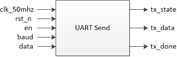

# UART发送模块

[TOC]


## 一：理论

UART（通用异步收发传输器）发送模块。UART为异步收发传输器，在发送数据时将并行数据转换为串行数据传输；在接收数据时，将串行数据转换为并行数据；这样可以节省IO口的使用且可以实现全双工传输和接收。常见接口有RS232、RS449、RS423、RS422和RS485等。由传输速度可以分为1200、2400、9600、19200、115200等波特率，波特率通常可以由时钟分频获得：


传输时序：起始位(1) + 数据位(8) + 校验位(0/1) + 停止位(1/1.5/2)。常用时序为 **8N1** ，即：8数据位、无奇偶校验、一个停止位：


FPGA设计思路为：由 `en` 标识一次数据传输的开始，并使用 `state_cnt` 进行状态计数和变换，归根结底其实是 **线性序列机** 的设计方式，后续还有很多设计也是采用类似方法。详细时序：


模块：




## 二：设计

### 2.1 UART发送

设计针对发送的详细时序：首先en接收到高脉冲，则标识传输开始，置tx_state为高，tx_state标识整个传输过程；之后开启波特率计数，当波特率计数满时state_cnt进行状态切换，同时根据state_cnt的状态值对tx赋值。

```verilog
module uart_send(
	input wire clk_50mhz,
	input wire rst_n,
	input wire en,
	input wire [2:0] baud,
	input wire [7:0] data,
	output reg tx_state,
	output reg tx_data,
	output reg tx_done
);


reg [12:0] bps_target;
reg [12:0] bps_cnt;

reg [3:0] state_cnt;


// 开始位检测,tx_state输出
always @(posedge clk_50mhz or negedge rst_n)
	if (rst_n == 1'b0)
		tx_state <= 1'b0;
	else if (en)
		tx_state <= 1'b1;
	else if (state_cnt == 4'd9 && bps_cnt == bps_target)
		tx_state <= 1'b0;
	else
		tx_state <= tx_state;


//
// 波特率计算和生成,当数据发送期间(state!=IDEL)生成波特率
// 序号baud    波特率bps    周期ns    分频计数值               50MHz系统时钟脉冲计数值
// 0           9600         104167    104167/sys_clk_period    5208-1
// 1           19200        52083     52083/sys_clk_period     2604-1
// 2           38400        26041     26041/sys_clk_period     1302-1
// 3           57600        17361     17361/sys_clk_period     868-1
// 4           115200       8680      8680/sys_clk_period      434-1
//
always @(posedge clk_50mhz or negedge rst_n)
	if (rst_n == 1'b0)
		bps_target <= 13'd5207;
	else
		case(baud)
			3'd0:bps_target<=13'd5207;
			3'd1:bps_target<=13'd2603;
			3'd2:bps_target<=13'd1301;
			3'd3:bps_target<=13'd867;
			3'd4:bps_target<=13'd433;
			default:bps_target<=13'd5207;
		endcase

always @(posedge clk_50mhz or negedge rst_n)
	if (rst_n == 1'b0)
		bps_cnt <= 13'd0;
	else if (tx_state) begin
		if (bps_cnt == bps_target)
			bps_cnt <= 13'd0;
		else
			bps_cnt <= bps_cnt + 1'b1;
	end
	else
		bps_cnt <= 13'd0;

always @(posedge clk_50mhz or negedge rst_n)
	if (rst_n == 1'b0)
		state_cnt <= 4'd0;
	else if (tx_state) begin
		if (bps_cnt == bps_target) begin
			if (state_cnt == 4'd9)
				state_cnt <= 4'd0;
			else
				state_cnt <= state_cnt + 1'b1;
		end
		else
			state_cnt <= state_cnt;
	end
	else
		state_cnt <= 4'd0;


// 状态迁移
always @(posedge clk_50mhz or negedge rst_n)
	if (rst_n == 1'b0) begin
		tx_data <= 1'b1;
		tx_done <= 1'b0;
	end
	else if (tx_state) begin
		case(state_cnt)
			4'd0:begin tx_data<=1'b0;tx_done<=1'b0;end
			4'd1:begin tx_data<=data[0];tx_done<=1'b0;end
			4'd2:begin tx_data<=data[1];tx_done<=1'b0;end
			4'd3:begin tx_data<=data[2];tx_done<=1'b0;end
			4'd4:begin tx_data<=data[3];tx_done<=1'b0;end
			4'd5:begin tx_data<=data[4];tx_done<=1'b0;end
			4'd6:begin tx_data<=data[5];tx_done<=1'b0;end
			4'd7:begin tx_data<=data[6];tx_done<=1'b0;end
			4'd8:begin tx_data<=data[7];tx_done<=1'b0;end
			4'd9:
				begin
					if (bps_cnt == bps_target) begin
						tx_data<=1'b1;
						tx_done<=1'b1;
					end
					else begin
						tx_data<=1'b1;
						tx_done<=1'b0;
					end
				end
			default:begin tx_data<=1'b1;tx_done<=1'b0;end
		endcase
	end
	else begin
		tx_data <= 1'b1;
		tx_done <= 1'b0;
	end
	
endmodule
```

需要关注的有以下几个地方：

- 起始：起始时en先为高，下一个时钟上升沿时传输过程标识tx_state置高；再下一个时钟时开始波特率计数和tx赋值。

  

- 中间过程：state_cnt变化之后下一个时钟tx的值才变化，基本无影响：

  

- 结束：结束发生在state_cnt计数由9跳变为0时；同时置传输标识tx_state为低表示传输过程结束，置tx_done为高标识一次传输结束；在下一个时钟上升沿时，由于tx_state已经为低，故tx恢复初始高电平状态，tx_done也恢复低电平；至此，一个完整传输过程结束。

  

- 连续传输：对于连续传输，一般监测posedge tx_done，此时en置高开始新一轮传输。由上述分析可知程序可以正常运行。


### 2.2 顶层模块

使用ISSP输入数据，顶层模块负责实例化：

```verilog
module top_uart_send(
	input wire clk_50mhz,
	input wire rst_n,
	input wire key_en,
	output wire tx_data,
	output wire tx_done
);

wire key_flag;
wire key_state;
key_filter key_filter_inst0(
	.clk_50mhz(clk_50mhz),
	.rst_n(rst_n),
	.key_in(key_en),
	.key_flag(key_flag),
	.key_state(key_state)
);

wire [7:0] data;
issp issp_inst0(
	.probe(),
	.source(data)
);

wire send_en;
assign send_en = key_flag && !key_state;
uart_send uart_send_inst0(
	.clk_50mhz(clk_50mhz),
	.rst_n(rst_n),
	.en(send_en),
	.baud(3'd0),
	.data(data),
	.tx_data(tx_data),
	.tx_done(tx_done)
);

endmodule
```


## 三：测试

### 3.1 UART发送模块测试

为了减少仿真时间，仿真时选择最大比特率。

testbench测试：

```verilog
`timescale 1ns/1ns


module tb_uart_send(
);

reg tb_clk_50mhz;
reg tb_rst_n;
reg tb_en;
reg [2:0] tb_baud;
reg [7:0] tb_data;
wire tb_tx_state;
wire tb_tx_data;
wire tb_tx_done;

parameter CLK_NS = 20;

// 例化
uart_send uart_send_inst0(
	.clk_50mhz(tb_clk_50mhz),
	.rst_n(tb_rst_n),
	.en(tb_en),
	.baud(tb_baud),
	.data(tb_data),
	.tx_state(tb_tx_state),
	.tx_data(tb_tx_data),
	.tx_done(tb_tx_done)
);

// 时钟
always #(CLK_NS / 2) tb_clk_50mhz = ~tb_clk_50mhz;

// 初始化
initial begin
	tb_clk_50mhz = 1'b0;
	tb_rst_n = 1'b0;
	tb_en = 1'b0;
	tb_baud = 3'd0;
	tb_data = 8'd0;
	#(CLK_NS * 100)
	
	tb_rst_n = 1'b1;
	#(CLK_NS * 100)
	
	tb_data = 8'b1011_1010;
	tb_baud = 3'd4;
	tb_en = 1'b1;
	#(CLK_NS)
	tb_en = 1'b0;
	@(posedge tb_tx_done)
	#(CLK_NS * 500)
	tb_data = 8'b1000_0001;
	tb_en = 1'b1;
	#(CLK_NS)
	tb_en = 1'b0;
	@(posedge tb_tx_done)
	#(CLK_NS * 500)
	
	$stop;
end

endmodule
```

仿真波形：


开始时波形：


中间波形：


结束时波形：


仿真波形与上述分析一致，符合预期。

### 3.2 顶层模块测试

采用ISSP输入数据方式，按按键发送一次。详见验证。


## 四：验证

基于AC620平台。

### 4.1 端口

ISSP + 输入(按键) + 完成(LED)

```verilog
clk_50mhz	-->	PIN_E1
rst_n		-->	PIN_M16
key_en		-->	PIN_E15
tx_data		-->	PIN_A6
tx_done		-->	PIN_A2

IO Standard: 3.3V-LVTTL
```

### 4.2 结果

运行正确。

