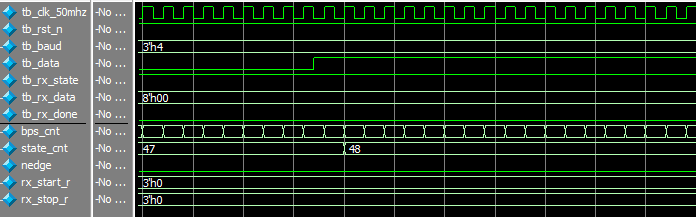

# UART接收模块

[TOC]


## 一：理论

UART接收模块：


IDEL状态检测data数据的下降沿，检测到下降沿时标识START开始，此时开始波特率计数和数据接收。为了提高采样的精度，将一个波特率周期划分为16个子周期，且在中间周期 $(5 + n*16)到(10 + n*16)$ 时进行6次采样；6次采样的平均结果作为此次数据结果。

模块：


## 二：设计

设计针对接收的详细时序：首先监测到下降沿，标识接收开始，置rx_state为高，rx_state标识整个传输过程；之后开启波特率计数，当波特率计数满时state_cnt进行状态切换并进行多次采样，多次采样结果暂时保存。接收结束时输出数据，并置rx_done一个时钟周期高电平。

```verilog
module uart_recv(
	input wire clk_50mhz,
	input wire rst_n,
	input wire [2:0] baud,
	input wire data,
	output reg rx_state,
	output reg [7:0] rx_data,
	output reg rx_done
);


reg [8:0] bps_target;
reg [8:0] bps_cnt;


// START + DATA0~7 + STOP
// 16 cnt for every state
// 2^7 < 10 * 16 = 160 < 2^8
reg [7:0] state_cnt;


// 开始位检测
wire nedge;
reg cur_data;
reg last_data;
always @(posedge clk_50mhz or negedge rst_n)
	if (rst_n == 1'b0) begin
		cur_data <= 1'b1;
		last_data <= 1'b1;
	end
	else begin
		cur_data <= data;
		last_data <= cur_data;
	end

assign nedge = (!cur_data) && last_data;

always @(posedge clk_50mhz or negedge rst_n)
	if (rst_n == 1'b0)
		rx_state <= 1'b0;
	else if (nedge)
		rx_state <= 1'b1;
	else if (state_cnt == 8'd156 && bps_cnt == bps_target)
		rx_state <= 1'b0;
	else
		rx_state <= rx_state;


//
// 波特率计算和生成
// 序号baud    波特率bps    周期ns    分频计数值               50MHz系统时钟脉冲计数值   波特率16分频计数
// 0           9600         104167    104167/sys_clk_period    5208-1                    5208/16-1=324
// 1           19200        52083     52083/sys_clk_period     2604-1                    2604/16-1=161
// 2           38400        26041     26041/sys_clk_period     1302-1                    1302/16-1=80
// 3           57600        17361     17361/sys_clk_period     868-1                     868/16-1=53
// 4           115200       8680      8680/sys_clk_period      434-1                     434/16-1=26
//
always @(posedge clk_50mhz or negedge rst_n)
	if (rst_n == 1'b0)
		bps_target <= 9'd324;
	else
		case(baud)
			3'd0:bps_target<=9'd324;
			3'd1:bps_target<=9'd161;
			3'd2:bps_target<=9'd80;
			3'd3:bps_target<=9'd53;
			3'd4:bps_target<=9'd26;
			default:bps_target<=9'd324;
		endcase

always @(posedge clk_50mhz or negedge rst_n)
	if (rst_n == 1'b0)
		bps_cnt <= 9'd0;
	else if (rx_state) begin
		if (bps_cnt == bps_target)
			bps_cnt <= 9'd0;
		else
			bps_cnt <= bps_cnt + 1'b1;
	end
	else
		bps_cnt <= 9'd0;

always @(posedge clk_50mhz or negedge rst_n)
	if (rst_n == 1'b0)
		state_cnt <= 8'd0;
	else if (rx_state) begin
		if (bps_cnt == bps_target) begin
			if (state_cnt == 8'd156)
				state_cnt <= 8'd0;
			else
				state_cnt <= state_cnt + 1'b1;
		end
		else
			state_cnt <= state_cnt;
	end
	else
		state_cnt <= 8'd0;


// 状态迁移，数据暂存
reg [2:0] rx_start_r;
reg [2:0] rx_stop_r;
reg [2:0] rx_data_r [7:0];
always @(negedge clk_50mhz or negedge rst_n)
	if (rst_n == 1'b0) begin
		rx_start_r <= 3'd0;
		rx_stop_r <= 3'd0;
		rx_data_r[0] <= 3'd0;
		rx_data_r[1] <= 3'd0;
		rx_data_r[2] <= 3'd0;
		rx_data_r[3] <= 3'd0;
		rx_data_r[4] <= 3'd0;
		rx_data_r[5] <= 3'd0;
		rx_data_r[6] <= 3'd0;
		rx_data_r[7] <= 3'd0;
	end
	else if (rx_state) begin
		if (bps_cnt == bps_target)
			case(state_cnt)
				0:
					begin
						rx_start_r <= 3'd0;
						rx_stop_r <= 3'd0;
						rx_data_r[0] <= 3'd0;
						rx_data_r[1] <= 3'd0;
						rx_data_r[2] <= 3'd0;
						rx_data_r[3] <= 3'd0;
						rx_data_r[4] <= 3'd0;
						rx_data_r[5] <= 3'd0;
						rx_data_r[6] <= 3'd0;
						rx_data_r[7] <= 3'd0;
					end
				5,6,7,8,9,10:rx_start_r<=rx_start_r+data;
				21,22,23,24,25,26:rx_data_r[0]<=rx_data_r[0]+data;
				37,38,39,40,41,42:rx_data_r[1]<=rx_data_r[1]+data;
				53,54,55,56,57,58:rx_data_r[2]<=rx_data_r[2]+data;
				69,70,71,72,73,74:rx_data_r[3]<=rx_data_r[3]+data;
				85,86,87,88,89,90:rx_data_r[4]<=rx_data_r[4]+data;
				101,102,103,104,105,106:rx_data_r[5]<=rx_data_r[5]+data;
				117,118,119,120,121,122:rx_data_r[6]<=rx_data_r[6]+data;
				133,134,135,136,137,138:rx_data_r[7]<=rx_data_r[7]+data;
				149,150,151,152,153,154:rx_stop_r<=rx_stop_r+data;
				default:
					begin
						rx_start_r <= rx_start_r;
						rx_stop_r <= rx_stop_r;
						rx_data_r[0] <= rx_data_r[0];
						rx_data_r[1] <= rx_data_r[1];
						rx_data_r[2] <= rx_data_r[2];
						rx_data_r[3] <= rx_data_r[3];
						rx_data_r[4] <= rx_data_r[4];
						rx_data_r[5] <= rx_data_r[5];
						rx_data_r[6] <= rx_data_r[6];
						rx_data_r[7] <= rx_data_r[7];
					end
			endcase
	end

// 输出
always @(posedge clk_50mhz or negedge rst_n)
	if (rst_n == 1'b0) begin
		rx_data <= 8'd0;
		rx_done <= 1'b0;
	end
	else if (state_cnt == 8'd156 && bps_cnt == bps_target) begin
			rx_data[0] <= rx_data_r[0][2];
			rx_data[1] <= rx_data_r[1][2];
			rx_data[2] <= rx_data_r[2][2];
			rx_data[3] <= rx_data_r[3][2];
			rx_data[4] <= rx_data_r[4][2];
			rx_data[5] <= rx_data_r[5][2];
			rx_data[6] <= rx_data_r[6][2];
			rx_data[7] <= rx_data_r[7][2];
			rx_done <= 1'b1;
	end
	else
		rx_done <= 1'b0;

endmodule
```

以下几点需要注意：

- 开始：开始时先检测data信号的下降沿，之后rx_state置高表示接收开始；下一个时钟周期时由于state_cnt为高，所以state_cnt开始波特率计数。

  

- 结束：理论上结束：state_cnt计数到159且开始切换到下一个计数时，置rx_state为低，表示一个接收过程结束；同时，rx_done置高表示接收结束，并更新rx_data数据值；等下一个时钟上升沿时，由于tx_state为低，故rx_done恢复默认低电平状态，而数据继续保持（不重置）。但考虑到要连续接收等情况，结束操作应该提前，见下部分连续接收。

  

- 连续接收：考虑到不错过下一个START的检测，将接收完成操作提前：当state_cnt计数到156时结束，而不是159。时序与上述理论停止的时序类似。


## 三：测试

testbench测试：

```verilog
`timescale 1ns/1ns


module tb_uart_recv(
);

reg tb_clk_50mhz;
reg tb_rst_n;
reg [2:0] tb_baud;
reg tb_data;
wire tb_rx_state;
wire [7:0] tb_rx_data;
wire tb_rx_done;

parameter CLK_NS = 20;

// 例化
uart_recv uart_recv_inst0(
	.clk_50mhz(tb_clk_50mhz),
	.rst_n(tb_rst_n),
	.baud(tb_baud),
	.data(tb_data),
	.rx_state(tb_rx_state),
	.rx_data(tb_rx_data),
	.rx_done(tb_rx_done)
);

// 时钟
always #(CLK_NS / 2) tb_clk_50mhz = ~tb_clk_50mhz;

// 初始化
initial begin
	tb_clk_50mhz = 1'b0;
	tb_rst_n = 1'b0;
	tb_baud = 3'd4;
	tb_data = 1'b1;
	#(CLK_NS * 100)
	
	tb_rst_n = 1'b1;
	#(CLK_NS * 100)
	// START
	tb_data = 1'b0;
	#(CLK_NS * 27 * 16)
	// DATA0 ~ DATA7
	tb_data = 1'b1;
	#(CLK_NS * 27 * 16)
	tb_data = 1'b0;
	#(CLK_NS * 27 * 16)
	tb_data = 1'b1;
	#(CLK_NS * 27 * 16)
	tb_data = 1'b0;
	#(CLK_NS * 27 * 16)
	tb_data = 1'b1;
	#(CLK_NS * 27 * 16)
	tb_data = 1'b0;
	#(CLK_NS * 27 * 16)
	tb_data = 1'b1;
	#(CLK_NS * 27 * 16)
	tb_data = 1'b0;
	#(CLK_NS * 27 * 16)
	// STOP
	tb_data = 1'b1;
	#(CLK_NS * 27 * 16)
	
	#(CLK_NS * 1000);
	
	$stop;
end

endmodule
```

仿真波形：


开始：


中间过程切换：



结束：


由仿真结果可知开始和数据跳变会滞后一点，但整体并未影响。设计符合预期。


## 四：验证

无。


