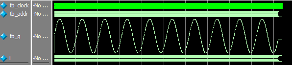

# ROM

[TOC]


## 一：理论

IP核ROM。与RAM区别：ROM只读，需提前加载.mif或.bin文件。


## 二：设计

IP核生成ROM，并配置.mif初始化文件。


## 三：测试

初始化mif文件为正弦波：

testbench测试：

```verilog
`timescale 1ns/1ns


module tb_rom(
);

reg tb_clock;
reg [7:0] tb_addr;
wire [7:0] tb_q;

parameter CLK_NS = 20;

// 例化
rom rom_inst0(
	.clock(tb_clock),
	.address(tb_addr),
	.q(tb_q)
);

// 时钟
always #(CLK_NS / 2) tb_clock = ~tb_clock;

// 初始化
integer i;
initial begin
	tb_clock = 1'b0;
	tb_addr = 8'd0;
	#CLK_NS
	for (i=0;i<2550;i=i+1) begin
		tb_addr = i;
		#CLK_NS
		tb_addr = tb_addr + 1'b1;
	end
	#(CLK_NS * 50)
	
	$stop;
end

endmodule
```

仿真波形：



符合预期波形。


## 四：验证

无。

