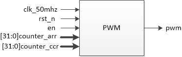
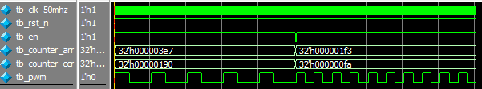

# PWM蜂鸣器

[TOC]


## 一：理论

蜂鸣器由PWM驱动，PWM由时钟分频产生，不同的PWM和占空比产生不同频率的声音。使用 `counter_arr` 计数产生PWM周期，使用 `counter_ccr` 计数产生PWM占空比。


```verilog
                    fclk                                    fclk
PWM频率：fpwm = -----------------    ---->    counter_arr = ----- - 1
                  counter_arr + 1                            fpwm

                  counter_ccr
PWM占空比：PW = --------------    ---->    counter_ccr = PW x counter_arr
                  counter_arr
```

模块：




## 二：设计

### 2.1 PWM生成模块设计

```verilog
module pwm_generator(
	input wire clk_50mhz,
	input wire rst_n,
	input wire en,
	input wire [31:0] counter_arr,
	input wire [31:0] counter_ccr,
	output reg pwm
);

// PWM频率产生
reg [31:0] cnt;
always @(posedge clk_50mhz or negedge rst_n)
	if (rst_n == 1'b0)
		cnt <= 32'd0;
	else if (en) begin
		if (cnt >= counter_arr)
			cnt <= 32'd0;
		else
			cnt <= cnt + 1'b1;
	end
	else
		cnt <= 32'd0;

// PWM占空比产生
always @(posedge clk_50mhz or negedge rst_n)
	if (rst_n == 1'b0)
		pwm <= 1'b0;
	else if (en) begin
		if (cnt < counter_ccr)
			pwm <= 1'b1;
		else
			pwm <= 1'b0;
	end
	else
		pwm <= 1'b0;

endmodule
```

### 2.2 蜂鸣器模块

通过生成不同频率和占空比的PWM，使蜂鸣器产生不同声音：

```verilog
module beep(
	input wire clk_50mhz,
	input wire rst_n,
	output wire bp
);

parameter CNT_500MS = 24_999_999;

reg [31:0] counter_arr;
wire [31:0] counter_ccr;

// PWM频率计数变量
localparam
	// 低音
	L1 = 191130,
	L2 = 170241,
	L3 = 151698,
	L4 = 143183,
	L5 = 127550,
	L6 = 113635,
	L7 = 101234,
	// 中音
	M1 = 95546,
	M2 = 85134,
	M3 = 75837,
	M4 = 71581,
	M5 = 63775,
	M6 = 56817,
	M7 = 50617,
	// 高音
	H1 = 47823,
	H2 = 42563,
	H3 = 37921,
	H4 = 35793,
	H5 = 31887,
	H6 = 28408,
	H7 = 25309;

// 500ms计时
reg [24:0] cnt;
always @(posedge clk_50mhz or negedge rst_n)
	if (rst_n == 1'b0)
		cnt <= 25'd0;
	else if (cnt == CNT_500MS)
		cnt <= 25'd0;
	else
		cnt <= cnt + 1'b1;

// 21个状态按500ms间隔依次切换
reg [4:0] pitch_state;
always @(posedge clk_50mhz or negedge rst_n)
	if (rst_n == 1'b0)
		pitch_state <= 5'd0;
	else if (cnt == CNT_500MS) begin
		if (pitch_state == 5'd20)
			pitch_state <= 5'd0;
		else
			pitch_state <= pitch_state + 1'b1;
	end
	else
		pitch_state <= pitch_state;

// PWM频率计数值
always @(*)
	case(pitch_state)
		5'd0:counter_arr = L1;
		5'd1:counter_arr = L2;
		5'd2:counter_arr = L3;
		5'd3:counter_arr = L4;
		5'd4:counter_arr = L5;
		5'd5:counter_arr = L6;
		5'd6:counter_arr = L7;
		5'd7:counter_arr = M1;
		5'd8:counter_arr = M2;
		5'd9:counter_arr = M3;
		5'd10:counter_arr = M4;
		5'd11:counter_arr = M5;
		5'd12:counter_arr = M6;
		5'd13:counter_arr = M7;
		5'd14:counter_arr = H1;
		5'd15:counter_arr = H2;
		5'd16:counter_arr = H3;
		5'd17:counter_arr = H4;
		5'd18:counter_arr = H5;
		5'd19:counter_arr = H6;
		5'd20:counter_arr = H7;
		default:counter_arr = L1;
	endcase

// PWM占空比计数值，始终为50%
assign counter_ccr = counter_arr >> 1;

// PWM例化
pwm_generator pwm_generator_inst0(
	.clk_50mhz(clk_50mhz),
	.rst_n(rst_n),
	.en(1'b1),
	.counter_arr(counter_arr),
	.counter_ccr(counter_ccr),
	.pwm(bp)
);

endmodule
```

- PWM占空比始终为50%：

  ```verilog
  assign counter_ccr = counter_arr >> 1;
  ```

- PWM计数在 `counter_arr` 切换时容易发生计数越过：

  ```verilog
  // 生成PWM模块...

  // cnt易越界
  if (cnt == counter_arr)
  	cnt <= 32'd0;
  else
  	cnt <= cnt + 1'b1;
  	
  // 修正越界
  if (cnt >= counter_arr)
  	cnt <= 32'd0;
  else
  	cnt <= cnt + 1'b1;
  ```

  例如：开始时 `counter_arr=95546` ，当计数为95000时counter_arr变化 `counter_arr=85134` ，继续计数时 `cnt == counter_arr` 条件已经不成立，除非cnt计数溢出后再到达此条件，显然与设计不符。更改判定条件为 `cnt >= counter_arr` 即可避免此情况。


## 三：测试

对PWM生成模块测试：

```verilog
`timescale 1ns/1ns


module tb_pwm_generator(
);

reg tb_clk_50mhz;
reg tb_rst_n;
reg tb_en;
reg [31:0] tb_counter_arr;
reg [31:0] tb_counter_ccr;
wire tb_pwm;

parameter CLK_NS = 20;

// 例化
pwm_generator pwm_generator_inst0(
	.clk_50mhz(tb_clk_50mhz),
	.rst_n(tb_rst_n),
	.en(tb_en),
	.counter_arr(tb_counter_arr),
	.counter_ccr(tb_counter_ccr),
	.pwm(tb_pwm)
);

// 时钟
always #(CLK_NS / 2) tb_clk_50mhz = ~tb_clk_50mhz;

// 初始化
initial begin
	tb_clk_50mhz = 1'b0;
	tb_rst_n = 1'b0;
	tb_en = 1'b0;
	tb_counter_arr = 0;
	tb_counter_ccr = 0;
	#(CLK_NS * 20)
	
	tb_rst_n = 1'b1;
	#(CLK_NS * 20)
	
	tb_counter_arr = 999; // 50KHz
	tb_counter_ccr = 400; // 40%
	tb_en = 1'b1;
	#(CLK_NS * 5000)
	
	tb_en = 1'b0;
	tb_counter_arr = 499; // 100KHz
	tb_counter_ccr = 250; // 50%
	#(CLK_NS * 20)
	tb_en = 1'b1;
	#(CLK_NS * 5000)
	
	$stop;
end

endmodule
```

仿真波形：



符合预期波形。


## 四：验证

基于AC620平台。

### 4.1 端口

beep蜂鸣器

```verilog
clk_50mhz	-->	PIN_E1
rst_n		-->	PIN_E16
bp			-->	PIN_L16

IO Standard: 3.3V-LVTTL
```

### 4.2 结果

运行正确。

