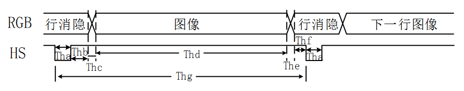

# TFT驱动

[TOC]


## 一：理论

TFT驱动。不带FIFO的TFT需要采用动态扫描的方式，即逐次对每个像素扫描，利用视觉暂留显示图像。对于一帧图像称为一个 **场** ，一场图像由 **行** 像素组成。为了减少扫描时带来的重影等不稳定现象，引入 **消隐** 概念。

场消隐时序：


行消隐时序：



消隐扫描（800x480）：


场有效区域：[24, 504)；行有效区域：[46, 846)；即有效数据区域：(46, 24)~(845, 503)。

TFT工作频率需满足协议标准。对于800x480的5寸屏，扫描总区域为1056x524，选取时钟为 **33MHz** ：

```verilog
33_000_000Hz / (1056x524) = 59.64Hz
```


## 二：设计

### 2.1 TFT驱动

根据工作时钟，使用 `tft_hcount_r` 进行水平计数，`tft_vcount_r` 进行垂直计数，水平计数满时垂直计数增1。

```verilog
module tft_driver(
	input wire clk_33mhz,
	input wire rst_n,
	input wire [15:0] rgb,
	
	output wire tft_clk,				// TFT时钟
	output wire [11:0] tft_hcount,// TFT行扫描计数(针对有效区域)
	output wire [11:0] tft_vcount,// TFT场扫描计数(针对有效区域)
	output wire [15:0] tft_rgb, 	// TFT数据输出
	output wire tft_hs,				// TFT行扫描同步
	output wire tft_vs,				// TFT场扫描同步
	output wire tft_de,				// TFT有效区域标志
	output wire tft_owm				// TFT复位
);


localparam
	// 行扫描参数
	hs_end = 10'd1,
	hdat_begin = 10'd46,
	hdat_end = 10'd846,
	h_end = 12'd1056,
	// 场扫描参数
	vs_end = 10'd1,
	vdat_begin = 10'd24,
	vdat_end = 10'd504,
	v_end = 10'd524;


// TFT时钟
assign tft_clk = clk_33mhz;


// TFT复位
assign tft_owm = rst_n;


// TFT行扫描
reg [11:0] tft_hcount_r;
always @(posedge clk_33mhz or negedge rst_n)
	if (rst_n == 1'b0)
		tft_hcount_r <= 12'd0;
	else if (tft_hcount_r == h_end)
		tft_hcount_r <= 12'd0;
	else
		tft_hcount_r <= tft_hcount_r + 12'd1;


// TFT场扫描
reg [11:0] tft_vcount_r;
always @(posedge clk_33mhz or negedge rst_n)
	if (rst_n == 1'b0)
		tft_vcount_r <= 12'd0;
	else if (tft_hcount_r == h_end) begin
		if (tft_vcount_r == v_end)
			tft_vcount_r <= 12'd0;
		else
			tft_vcount_r <= tft_vcount_r + 12'd1;
	end


// 扫描各区域划分，及数据赋值
assign tft_hcount = tft_de ? (tft_hcount_r - hdat_begin) : 12'd0;
assign tft_vcount = tft_de ? (tft_vcount_r - vdat_begin) : 12'd0;

assign tft_hs = (tft_hcount_r > hs_end);
assign tft_vs = (tft_vcount_r > vs_end);
assign tft_de = ((tft_hcount_r >= hdat_begin) && (tft_hcount_r < hdat_end))
				&& ((tft_vcount_r >= vdat_begin) && (tft_vcount_r < vdat_end));

assign tft_rgb = tft_de ? rgb : 16'h0000;


endmodule
```

### 2.2 显示色块

TFT显示色块：

```verilog
  __________________________
  |    r0c0    |    r0c0     |
  |------------|-------------|
  |    r1c0    |    r1c1     |
  |------------|-------------|
  |    r2c0    |    r2c1     |
  |------------|-------------|
  |____r3c0____|____r3c1_____|
```

```verilog
module tft(
	input wire clk_50mhz,
	input wire rst_n,
	
	output wire tft_clk,
	output wire [15:0] tft_rgb,
	output wire tft_hs,
	output wire tft_vs,
	output wire tft_de,
	output wire tft_owm
);


reg [15:0] dis_data;
wire [11:0] hcount;
wire [11:0] vcount;
wire clk_33mhz;


// 颜色定义
localparam 
	BLACK = 16'h0000,
	BLUE = 16'h001F,
	RED = 16'hF800,
	PURPPLE	= 16'hF81F,
	GREEN = 16'h07E0,
	CYAN = 16'h07FF,
	YELLOW = 16'hFFE0,
	WHITE = 16'hFFFF;

// 像素块颜色定义
localparam
	r0c0 = BLACK,
	r0c1 = BLUE,
	r1c0 = RED,
	r1c1 = PURPPLE,
	r2c0 = GREEN,
	r2c1 = CYAN,
	r3c0 = YELLOW,
	r3c1 = WHITE;


// PLL例化
tft_pll tft_pll_inst0(
	.inclk0(clk_50mhz),
	.c0(clk_33mhz)
);

// TFTDriver例化
tft_driver tft_driver_inst0(
	.clk_33mhz(clk_33mhz),
	.rst_n(rst_n),
	.rgb(dis_data),
	.tft_clk(tft_clk),
	.tft_hcount(hcount),
	.tft_vcount(vcount),
	.tft_rgb(tft_rgb),
	.tft_hs(tft_hs),
	.tft_vs(tft_vs),
	.tft_de(tft_de),
	.tft_owm(tft_owm)
);


// 显示数据赋值
wire r0_act = vcount >= 0 && vcount < 120;
wire r1_act = vcount >= 120 && vcount < 240;
wire r2_act = vcount >= 240 && vcount < 360;
wire r3_act = vcount >= 360 && vcount < 480;
wire c0_act = hcount >= 0 && hcount < 400;
wire c1_act = hcount >= 400 && hcount < 800;

wire r0c0_act = r0_act && c0_act;
wire r0c1_act = r0_act && c1_act;
wire r1c0_act = r1_act && c0_act;
wire r1c1_act = r1_act && c1_act;
wire r2c0_act = r2_act && c0_act;
wire r2c1_act = r2_act && c1_act;
wire r3c0_act = r3_act && c0_act;
wire r3c1_act = r3_act && c1_act;

always @(*)
	case({r3c1_act, r3c0_act, r2c1_act, r2c0_act,
			r1c1_act, r1c0_act, r0c1_act, r0c0_act})
		8'b0000_0001:dis_data = r0c0;
		8'b0000_0010:dis_data = r0c1;
		8'b0000_0100:dis_data = r1c0;
		8'b0000_1000:dis_data = r1c1;
		8'b0001_0000:dis_data = r2c0;
		8'b0010_0000:dis_data = r2c1;
		8'b0100_0000:dis_data = r3c0;
		8'b1000_0000:dis_data = r3c1;
		default:dis_data = r0c0;
	endcase

endmodule
```


## 三：测试

未仿真测试，详见验证。


## 四：验证

基于AC620平台。

### 4.1 端口

```verilog
clk_50mhz	-->	PIN_E1
rst_n		-->	PIN_E16

IO Standard: 3.3V-LVTTL
```

### 4.2 结果

运行正确。

