# DAC-TLV5618

[TOC]


## 一：理论

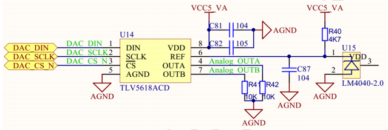

DAC转换模块，支持OUTA和OUTB两路输出。采用 **SPI** 时序：

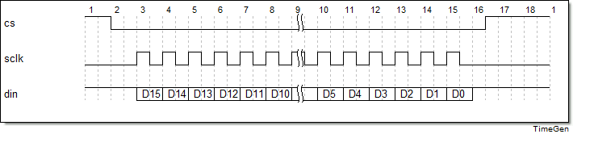

16bit数据：

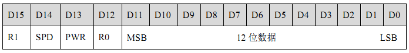

SPD为速度控制位，PWR为电源控制位，R1和R0标识寄存器或缓冲区：

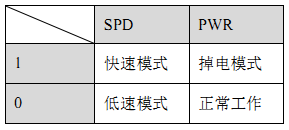

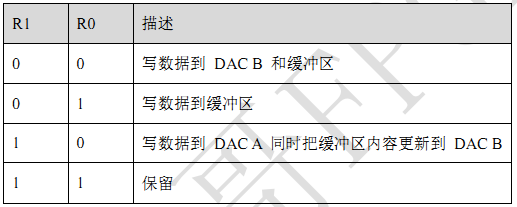

典型组合：

1. 快速模式，DAC-A输出：

   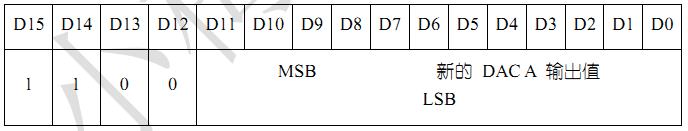

2. 快速模式，DAC-B输出：

   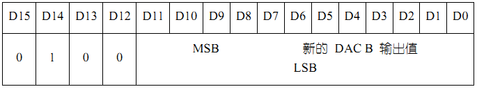

3. 低速模式，DAC-A和DAC-B同时输出(先写DAC-B数据到缓冲区，然后写DAC-A数据并更新缓冲区到DAC-B)：

   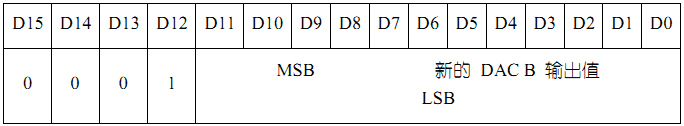

   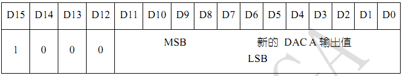

4. 掉电模式：

   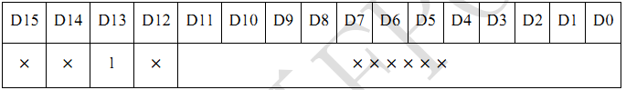


电压范围：

$$V0(ADC A|B)=2*REF*CODE/2^{12}(V)$$

TLV5618工作频率选择 **12.5MHz** 。

模块：

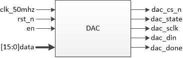


## 二：设计

采用和UART发送模块类似的设计方法，并根据SPI典型时序编写代码：en为高时表示开始一次传输；首先置cs为低表示片选有效，之后生成SPI时钟sclk，并在sclk的上升沿更新数据。

设计采用线性序列，时钟12.5MHz 时时钟反转周期为25MHz，计数值：2。

```verilog
module dac(
	input wire clk_50mhz,
	input wire rst_n,
	input wire en,
	input wire [15:0] data,
	output wire dac_cs_n,
	output reg dac_state,
	output reg dac_sclk,
	output reg dac_din,
	output reg dac_done
);

parameter CNT_25MHZ = 1;

reg [1:0] cnt;
reg [5:0] state_cnt;

// state(begin and stop)
always @(posedge clk_50mhz or negedge rst_n)
	if (rst_n == 1'b0)
		dac_state <= 1'b0;
	else if (en)
		dac_state <= 1'b1;
	else if (state_cnt == 6'd32 && cnt == CNT_25MHZ)
		dac_state <= 1'b0;
	else
		dac_state <= dac_state;
		
assign dac_cs_n = ~dac_state;

// 50MHz --> 25MHz
// 状态计数
always @(posedge clk_50mhz or negedge rst_n)
	if (rst_n == 1'b0)
		cnt <= 2'd0;
	else if (dac_state) begin
		if (cnt == CNT_25MHZ)
			cnt <= 2'd0;
		else
			cnt <= cnt + 1'b1;
	end
	else
		cnt <= 2'd0;
		
always @(posedge clk_50mhz or negedge rst_n)
	if (rst_n == 1'b0)
		state_cnt <= 6'd0;
	else if (dac_state) begin
		if (cnt == CNT_25MHZ) begin
			if (state_cnt == 6'd32)
				state_cnt <= 6'd0;
			else
				state_cnt <= state_cnt + 1'b1;
		end
		else
			state_cnt <= state_cnt;
	end
	else
		state_cnt <= 6'd0;

// 状态赋值
always @(posedge clk_50mhz or negedge rst_n)
	if (rst_n == 1'b0) begin
		dac_sclk <= 1'b0;
		dac_din <= 1'b1;
		dac_done <= 1'b0;
	end
	else if (dac_state) begin
		if (cnt == CNT_25MHZ)
			case(state_cnt)
				0:begin dac_sclk <= 1'b1;dac_din <= data[15];dac_done <= 1'b0;end
				1,3,5,7,9,11,13,15,17,19,21,23,25,27,29,31:begin dac_sclk <= 1'b0;end
				2:begin dac_sclk <= 1'b1;dac_din <= data[14];end
				4:begin dac_sclk <= 1'b1;dac_din <= data[13];end
				6:begin dac_sclk <= 1'b1;dac_din <= data[12];end
				8:begin dac_sclk <= 1'b1;dac_din <= data[11];end
				10:begin dac_sclk <= 1'b1;dac_din <= data[10];end
				12:begin dac_sclk <= 1'b1;dac_din <= data[9];end
				14:begin dac_sclk <= 1'b1;dac_din <= data[8];end
				16:begin dac_sclk <= 1'b1;dac_din <= data[7];end
				18:begin dac_sclk <= 1'b1;dac_din <= data[6];end
				20:begin dac_sclk <= 1'b1;dac_din <= data[5];end
				22:begin dac_sclk <= 1'b1;dac_din <= data[4];end
				24:begin dac_sclk <= 1'b1;dac_din <= data[3];end
				26:begin dac_sclk <= 1'b1;dac_din <= data[2];end
				28:begin dac_sclk <= 1'b1;dac_din <= data[1];end
				30:begin dac_sclk <= 1'b1;dac_din <= data[0];end
				32:begin dac_sclk <= 1'b0;dac_din <= 1'b1;dac_done <= 1'b1;end
				default:;
			endcase
	end
	else begin
		dac_din <= 1'b1;
		dac_sclk <= 1'b0;
		dac_done <= 1'b0;
	end

endmodule
```


## 三：测试

使用不同数据，使能三次转换过程：

testbench测试：

```verilog
`timescale 1ns/1ns


module tb_dac(
);

reg tb_clk_50mhz;
reg tb_rst_n;
reg tb_en;
reg [15:0] tb_data;
wire tb_dac_cs_n;
wire tb_dac_state;
wire tb_dac_sclk;
wire tb_dac_din;
wire tb_dac_done;

parameter CLK_NS = 20;

// 例化
dac dac_inst0(
	.clk_50mhz(tb_clk_50mhz),
	.rst_n(tb_rst_n),
	.en(tb_en),
	.data(tb_data),
	.dac_cs_n(tb_dac_cs_n),
	.dac_state(tb_dac_state),
	.dac_sclk(tb_dac_sclk),
	.dac_din(tb_dac_din),
	.dac_done(tb_dac_done)
);

// 时钟
always #(CLK_NS / 2) tb_clk_50mhz = ~tb_clk_50mhz;

// 初始化
initial begin
	tb_clk_50mhz = 1'b0;
	tb_rst_n = 1'b0;
	tb_en = 1'b0;
	tb_data = 16'd0;
	#(CLK_NS * 20)
	
	tb_rst_n = 1'b1;
	#(CLK_NS * 20)
	
	tb_data = 16'hc_aaa;
	tb_en = 1'b1;
	#(CLK_NS)
	tb_en = 1'b0;
	//wait(tb_dac_done);
	#(CLK_NS * 100)
	
	tb_data = 16'hc_555;
	tb_en = 1'b1;
	#(CLK_NS)
	tb_en = 1'b0;
	//wait(tb_dac_done);
	#(CLK_NS * 100)
	
	tb_data = 16'h4_555;
	tb_en = 1'b1;
	#(CLK_NS)
	tb_en = 1'b0;
	//wait(tb_dac_done);
	#(CLK_NS * 100)
	
	$stop;
end

endmodule
```

仿真波形：

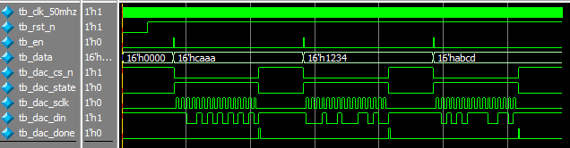

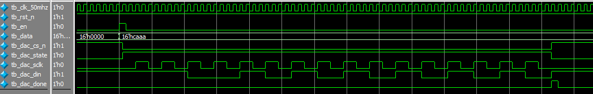

起始时会滞后一段时间，这是由于状态迁移的判定条件决定，对后续波形和功能并无影响。符合预期波形。


## 四：验证

无

