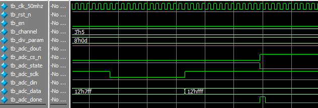

# ADC-ADC128S022

[TOC]


## 一：理论

ADC模数转换模块。


支持0~7八个转换通道。采用SPI时序：


din在sclk的上升沿被采样，因此在sclk的下降沿更新din的值；dout会在sclk的下降沿更新输出，输出有效位为12bit，前面是4bit前导0。

ADDx指定当前使用的通道输入：

| ADD2 | ADD1 | ADD0 | 输入通道         |
| ---- | ---- | ---- | ------------ |
| 0    | 0    | 0    | IN0(Default) |
| 0    | 0    | 1    | IN1          |
| 0    | 1    | 0    | IN2          |
| 0    | 1    | 1    | IN3          |
| 1    | 0    | 0    | IN4          |
| 1    | 0    | 1    | IN5          |
| 1    | 1    | 0    | IN6          |
| 1    | 1    | 1    | IN7          |

模块：


## 二：设计

采用线性序列方式，en使能一次转换过程：

```verilog
module adc(
	input wire clk_50mhz,
	input wire rst_n,
	input wire en,
	input wire [2:0] channel,
	input wire [7:0] div_param,
	input wire adc_dout,
	output wire adc_cs_n,
	output reg adc_state,
	output reg adc_sclk,
	output reg adc_din,
	output reg [11:0] adc_data,
	output reg adc_done
);

reg [7:0] cnt;

reg [5:0] state_cnt;

// State(start/stop)
always @(posedge clk_50mhz or negedge rst_n)
	if (rst_n == 1'b0)
		adc_state <= 1'b0;
	else if (en)
		adc_state <= 1'b1;
	else if (state_cnt == 6'd32 && cnt == (div_param - 1'b1))
		adc_state <= 1'b0;
	else
		adc_state <= adc_state;
		
assign adc_cs_n = ~adc_state;

// 50MHz --> 50MHz / div_param
// 状态计数
always @(posedge clk_50mhz or negedge rst_n)
	if (rst_n == 1'b0)
		cnt <= 8'd0;
	else if (adc_state) begin
		if (cnt == (div_param - 1'b1))
			cnt <= 8'd0;
		else
			cnt <= cnt + 1'b1;
	end
	else
		cnt <= 8'd0;
		
always @(posedge clk_50mhz or negedge rst_n)
	if (rst_n == 1'b0)
		state_cnt <= 6'd0;
	else if (adc_state) begin
		if (cnt == (div_param - 1'b1)) begin
			if (state_cnt == 6'd32)
				state_cnt <= 6'd0;
			else
				state_cnt <= state_cnt + 1'b1;
		end
		else
			state_cnt <= state_cnt;
	end
	else
		state_cnt <= 6'd0;

// 状态迁移
always @(posedge clk_50mhz or negedge rst_n)
	if (rst_n == 1'b0) begin
		adc_sclk <= 1'b1;
		adc_din <= 1'b1;
		adc_data <= 12'd0;
		adc_done <= 1'b0;
	end
	else if (adc_state) begin
		if (cnt == (div_param - 1'b1))
			case(state_cnt)
				6'd0:begin adc_sclk<=1'b0; adc_din<=1'b0;adc_data<=12'd0;adc_done<=1'b0;end
				6'd1:begin adc_sclk<=1'b1;end
				6'd2:begin adc_sclk<=1'b0;end
				6'd3:begin adc_sclk<=1'b1;end
				6'd4:begin adc_sclk<=1'b0;adc_din<=channel[2];end
				6'd5:begin adc_sclk<=1'b1;end
				6'd6:begin adc_sclk<=1'b0;adc_din<=channel[1];end
				6'd7:begin adc_sclk<=1'b1;end
				6'd8:begin adc_sclk<= 1'b0; adc_din<=channel[0];end
				6'd9,6'd11,6'd13,6'd15,6'd17,6'd19,6'd21,6'd23,6'd25,6'd27,6'd29,6'd31:
					begin adc_sclk <= 1'b1;adc_data <= {adc_data[10:0], adc_dout};end
				6'd10,6'd12,6'd14,6'd16,6'd18,6'd20,6'd22,6'd24,6'd26,6'd28,6'd30:
					begin adc_sclk <= 1'b0;end
				6'd32:begin adc_sclk<=1'b1;adc_done<=1'b1;end
				default:;
			endcase
	end
	else begin
		adc_sclk <= 1'b1;
		adc_din <= 1'b1;
		adc_done <= 1'b0;
	end

endmodule
```


## 三：测试

testbench测试：

```verilog
`timescale 1ns/1ns


module tb_adc(
);

reg tb_clk_50mhz;
reg tb_rst_n;
reg tb_en;
reg [2:0] tb_channel;
reg [7:0] tb_div_param;
reg tb_adc_dout;
wire tb_adc_cs_n;
wire tb_adc_state;
wire tb_adc_sclk;
wire tb_adc_din;
wire [11:0] tb_adc_data;
wire tb_adc_done;

parameter CLK_NS = 20;

// 例化
adc adc_inst0(
	.clk_50mhz(tb_clk_50mhz),
	.rst_n(tb_rst_n),
	.en(tb_en),
	.channel(tb_channel),
	.div_param(tb_div_param),
	.adc_dout(tb_adc_dout),
	.adc_cs_n(tb_adc_cs_n),
	.adc_state(tb_adc_state),
	.adc_sclk(tb_adc_sclk),
	.adc_din(tb_adc_din),
	.adc_data(tb_adc_data),
	.adc_done(tb_adc_done)
);

// 时钟
always #(CLK_NS / 2) tb_clk_50mhz = ~tb_clk_50mhz;

// 初始化
initial begin
	tb_clk_50mhz = 1'b0;
	tb_rst_n = 1'b0;
	tb_en = 1'b0;
	tb_channel = 3'd0;
	tb_div_param = 8'd0;
	tb_adc_dout = 1'b0;
	#(CLK_NS * 20)
	
	tb_rst_n = 1'b1;
	#(CLK_NS * 20)
	
	tb_channel = 3'd5;
	tb_div_param = 8'd13;
	tb_adc_dout = 1'b1;
	tb_en = 1'b1;
	#(CLK_NS);
	tb_en = 1'b0;
	
	//wait(tb_adc_done);
	#(CLK_NS * 1000)
	
	$stop;
end

endmodule
```

仿真波形：


起始：


结束：



符合预期波形。


## 四：验证

无。

