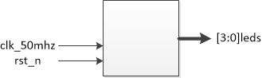
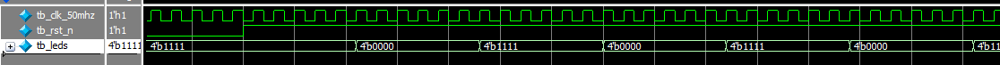

# LED定时闪烁

[TOC]


## 一：理论

LED定时闪烁。四个LED每隔500ms闪烁一次(状态反转一次)。



由于FPGA频率为50MHz，即时钟周期为20ns。要实现500ms：

```verilog
500ms = 500_000_000ns
500_000_000ns / 20ns = 25_000_000
2^24 < 25_000_000 < 2^25
```


## 二：设计

定时器的使用；时钟分频的计数实现。

```verilog
module led_flash(
	input wire clk_50mhz,
	input wire rst_n,
	output reg [3:0] leds
);

parameter CNT_500MS = 24_999_999;

// 计数器
reg [24:0] cnt;
always @(posedge clk_50mhz or negedge rst_n)
	if (rst_n == 1'b0)
		cnt <= 25'd0;
	else if (cnt == CNT_500MS)
		cnt <= 25'd0;
	else
		cnt <= cnt + 1'b1;

// LEDs闪烁
always @(posedge clk_50mhz or negedge rst_n)
	if (rst_n == 1'b0)
		leds <= 4'b1111;
	else if (cnt == CNT_500MS)
		leds <= ~leds;
	else
		leds <= leds;

endmodule
```


## 三：测试

为了节省测试时间，将500ms的计数值24_999_999在测试时候改为5，即每计数完6个时钟周期LED状态反转一次。reset之后预留一定的测试时间即可。

testbench测试：

```verilog
`timescale 1ns/1ns


module tb_led_flash(
);

reg tb_clk_50mhz;
reg tb_rst_n;
wire [3:0] tb_leds;

parameter CLK_NS = 20;

// 例化
led_flash #(5) led_flash_inst0(
	.clk_50mhz(tb_clk_50mhz),
	.rst_n(tb_rst_n),
	.leds(tb_leds)
);

// 时钟
always #(CLK_NS / 2) tb_clk_50mhz = ~tb_clk_50mhz;

// 初始化
initial begin
	tb_clk_50mhz = 1'b0;
	tb_rst_n = 1'b0;
	#(CLK_NS * 10)
	
	tb_rst_n = 1'b1;
	#(CLK_NS * 1000)
	
	$stop;
end

endmodule
```

仿真波形：



每6个时钟周期LED状态反转一次，符合预期。


## 四：验证

基于AC620平台。

### 4.1 端口

输出(LED)，LED默认高电平灭，低电平亮。

```verilog
clk_50mhz	-->	PIN_E1
rst_n		-->	PIN_E16
leds[0]		-->	PIN_A2
leds[1]		-->	PIN_B3
leds[2]		-->	PIN_A4
leds[3]		-->	PIN_A3

IO Standard: 3.3V-LVTTL
```

### 4.2 结果

运行正确。

