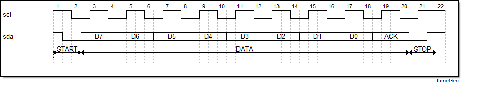
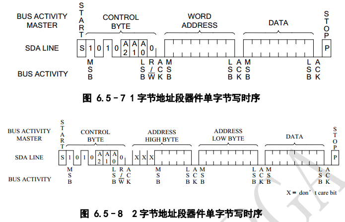
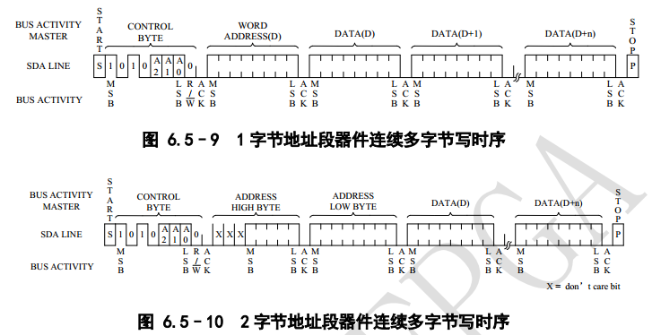
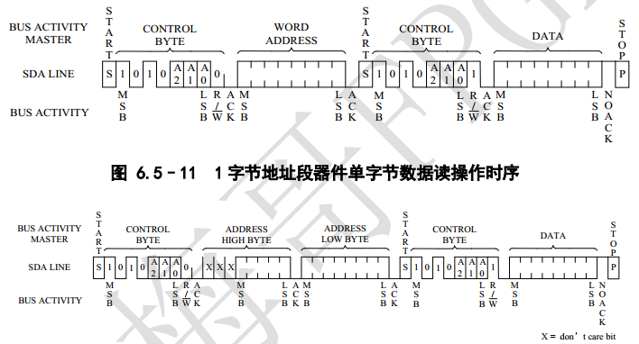
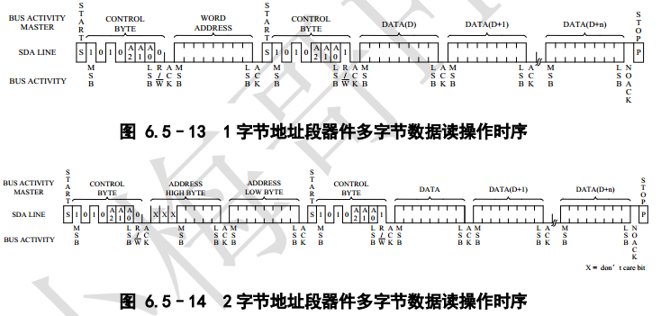

# EEPROM-IIC总线

[TOC]


## 一：理论

EEPROM存储器，使用IIC协议通信。IIC总线时序，总是发生在SCLK稳定时：

- 起始位：SCLK为高时，SDA发生下降沿变化；
- 数据传输位：SCLK为高时保证SDA数据稳定；
- 结束位：SCLK为高时，SDA发生上升沿变化。



读写时序：

- 单字节写时序：

  

- 连续写时序：

  

- 单字节读时序：

  

- 连续读时序：

  


## 二：设计


## 三：测试

testbench测试：

```verilog

```

仿真波形：


符合预期波形。


## 四：验证

基于AC620平台。

### 4.1 端口

EEPROM

```verilog


IO Standard: 3.3V-LVTTL
```

### 4.2 结果

运行正确。

