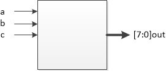

# 3-8译码器

[TOC]


## 一：理论

3-8译码器。实现3线转8线操作，真值表：

| a    | b    | c    | out       |
| ---- | ---- | ---- | --------- |
| 0    | 0    | 0    | 0000_0001 |
| 0    | 0    | 1    | 0000_0010 |
| 0    | 1    | 0    | 0000_0100 |
| 0    | 1    | 1    | 0000_1000 |
| 1    | 0    | 0    | 0001_0000 |
| 1    | 0    | 1    | 0010_0000 |
| 1    | 1    | 0    | 0100_0000 |
| 1    | 1    | 1    | 1000_0000 |




## 二：设计

case语句使用。

```verilog
module decoder3_8(
	input wire a,
	input wire b,
	input wire c,
	output reg [7:0] out
);

always @(a, b, c)
	case({a, b, c})
		3'b000:out = 8'b0000_0001;
		3'b001:out = 8'b0000_0010;
		3'b010:out = 8'b0000_0100;
		3'b011:out = 8'b0000_1000;
		3'b100:out = 8'b0001_0000;
		3'b101:out = 8'b0010_0000;
		3'b110:out = 8'b0100_0000;
		3'b111:out = 8'b1000_0000;
	endcase

endmodule
```


## 三：测试

### 3.1 TestBench

测试需包括真值表所有译码情况：

testbench测试：

```verilog
`timescale 1ns/1ns


module tb_decoder3_8(
);

reg tb_a;
reg tb_b;
reg tb_c;
wire [7:0] tb_out;

// 例化
decoder3_8 decoder3_8_inst0(
	.a(tb_a),
	.b(tb_b),
	.c(tb_c),
	.out(tb_out)
);

// 初始化
initial begin
	tb_a = 0;tb_b = 0;tb_c = 0;
	#20
	tb_a = 0;tb_b = 0;tb_c = 1;
	#20
	tb_a = 0;tb_b = 1;tb_c = 0;
	#20
	tb_a = 0;tb_b = 1;tb_c = 1;
	#20
	tb_a = 1;tb_b = 0;tb_c = 0;
	#20
	tb_a = 1;tb_b = 0;tb_c = 1;
	#20
	tb_a = 1;tb_b = 1;tb_c = 0;
	#20
	tb_a = 1;tb_b = 1;tb_c = 1;
	#20
	
	$stop;
end

endmodule
```

### 3.2 波形


## 四：验证

无

