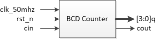
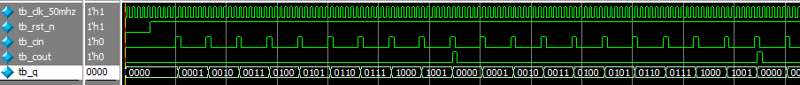

# BCD计数器

[TOC]


## 一：理论

BCD码计数器。BCD码分为8421码、2421码、余三码等，这里使用8421码：

| 十进制数 | 8421码 |
| ---- | ----- |
| 0    | 0000  |
| 1    | 0001  |
| 2    | 0010  |
| 3    | 0011  |
| 4    | 0100  |
| 5    | 0101  |
| 6    | 0110  |
| 7    | 0111  |
| 8    | 1000  |
| 9    | 1001  |

8421码基本和十六进制表示相同，但可表示范围只有0~9。在时钟上升沿，如果cin为高则计数加1，加满后再从0开始且进位信号cout置高一个时钟周期。




## 二：设计

计数器、时钟周期控制。

```verilog
module bcd_counter(
	input wire clk_50mhz,
	input wire rst_n,
	input wire cin,
	output reg cout,
	output reg [3:0] q
);

// 计数器
always @(posedge clk_50mhz or negedge rst_n)
	if (rst_n == 1'b0)
		q <= 4'd0;
	else if (cin == 1'b1) begin
		if (q == 4'd9)
			q <= 4'd0;
		else
			q <= q + 1'b1;
	end
	
// 进位信号
always @(posedge clk_50mhz or negedge rst_n)
	if (rst_n == 1'b0)
		cout <= 1'b0;
	else if (cin == 1'b1 && q == 4'd9)
		cout <= 1'b1;
	else
		cout <= 1'b0;

endmodule
```


## 三：测试

reset之后适当给入cin累加信号，不断重复则累计输出和进位输出依次变化。

testbench测试：

```verilog
`timescale 1ns/1ns


module tb_bcd_counter(
);

reg tb_clk_50mhz;
reg tb_rst_n;
reg tb_cin;
wire tb_cout;
wire [3:0] tb_q;

parameter CLK_NS = 20;

// 例化
bcd_counter bcd_counter_inst0(
	.clk_50mhz(tb_clk_50mhz),
	.rst_n(tb_rst_n),
	.cin(tb_cin),
	.cout(tb_cout),
	.q(tb_q)
);

// 时钟
always #(CLK_NS / 2) tb_clk_50mhz = ~tb_clk_50mhz;

// 初始化
initial begin
	tb_clk_50mhz = 1'b0;
	tb_rst_n = 1'b0;
	tb_cin = 1'b0;
	#(CLK_NS * 5)
	
	tb_rst_n = 1'b1;
	#(CLK_NS * 5)
	
	repeat(30) begin
		tb_cin = 1'b1;
		#(CLK_NS)
		tb_cin = 1'b0;
		#(CLK_NS * 5);
	end
	#(CLK_NS * 100)
	
	$stop;
end

endmodule
```

仿真波形：



波形符合预期。


## 四：验证

无

