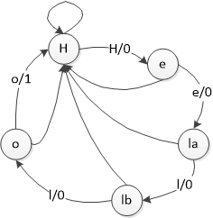
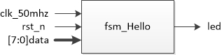
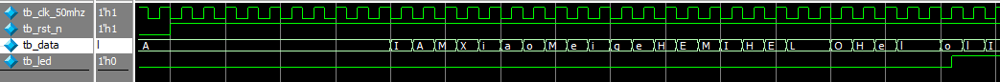
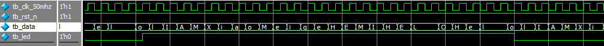

# Hello序列检测状态机

[TOC]


## 一：理论

状态机即将过程划分为各种状态，并按照跳转条件进行状态迁移。对于Hello序列检测状态机，迁移图为：



初始状态为H状态（等待H状态），检测到H之后跳转到e状态，否则还原为初始状态H状态；在e状态时（等待e状态），如果检测到e跳转到la状态，否则还原为初始状态H状态；...；在o状态时（等待o状态），如果检测到o跳转到初始状态H状态，并输出一个周期的高电平；否则还原为初始状态H状态。




## 二：设计

fsm状态机，状态迁移。状态码推荐使用 **独热码** 。一般建议将状态机的迁移和其他部分独立处理。

```verilog
module fsm_hello(
	input wire clk_50mhz,
	input wire rst_n,
	input wire [7:0] data,
	output reg led
);

parameter BYTE_H = 5'b0_0001;
parameter BYTE_e = 5'b0_0010;
parameter BYTE_la = 5'b0_0100;
parameter BYTE_lb = 5'b0_1000;
parameter BYTE_o = 5'b1_0000;

reg [4:0] state;

// 状态机迁移
always @(posedge clk_50mhz or negedge rst_n)
	if (rst_n == 1'b0)
		state <= BYTE_H;
	else
		case(state)
			BYTE_H:
				if (data == "H")
					state <= BYTE_e;
				else
					state <= BYTE_H;
			BYTE_e:
				if (data == "e")
					state <= BYTE_la;
				else
					state <= BYTE_H;
			BYTE_la:
				if (data == "l")
					state <= BYTE_lb;
				else
					state <= BYTE_H;
			BYTE_lb:
				if (data == "l")
					state <= BYTE_o;
				else
					state <= BYTE_H;
			BYTE_o:
				if (data == "o")
					state <= BYTE_H;
				else
					state <= BYTE_H;
			default:state <= BYTE_H;
		endcase

// 输出
always @(posedge clk_50mhz or negedge rst_n)
	if (rst_n == 1'b0)
		led <= 1'b0;
	else if (state == BYTE_o && data == "o")
		led <= ~led;
	else
		led <= led;

endmodule
```


## 三：测试

reset之后模拟输入多个字符。

testbench测试：

```verilog
`timescale 1ns/1ns


module tb_fsm_hello(
);

reg tb_clk_50mhz;
reg tb_rst_n;
reg [7:0] tb_data;
wire tb_led;

parameter CLK_NS = 20;

// 例化
fsm_hello fsm_hello_inst0(
	.clk_50mhz(tb_clk_50mhz),
	.rst_n(tb_rst_n),
	.data(tb_data),
	.led(tb_led)
);

// 时钟
always #(CLK_NS / 2) tb_clk_50mhz = ~tb_clk_50mhz;

// 初始化
initial begin
	tb_clk_50mhz = 1'b0;
	tb_rst_n = 1'b0;
	tb_data = "A";
	#(CLK_NS * 10)
	
	tb_rst_n = 1'b1;
	#(CLK_NS * 10)
	
	repeat(20) begin
		tb_data = "I";
		#(CLK_NS)
		tb_data = "A";
		#(CLK_NS)
		tb_data = "M";
		#(CLK_NS)
		tb_data = "X";
		#(CLK_NS)
		tb_data = "i";
		#(CLK_NS)
		tb_data = "a";
		#(CLK_NS)
		tb_data = "o";
		#(CLK_NS)
		tb_data = "M";
		#(CLK_NS)
		tb_data = "e";
		#(CLK_NS)
		tb_data = "i";
		#(CLK_NS)
		tb_data = "g";
		#(CLK_NS)
		tb_data = "e";
		#(CLK_NS)
		tb_data = "H";
		#(CLK_NS)
		tb_data = "E";
		#(CLK_NS)
		tb_data = "M";
		#(CLK_NS)
		tb_data = "I";
		#(CLK_NS)
		tb_data = "H";
		#(CLK_NS)
		tb_data = "E";
		#(CLK_NS)
		tb_data = "L";
		#(CLK_NS)
		tb_data = "L";
		#(CLK_NS)
		tb_data = "O";
		#(CLK_NS)
		tb_data = "H";
		#(CLK_NS)
		tb_data = "e";
		#(CLK_NS)
		tb_data = "l";
		#(CLK_NS)
		tb_data = "l";
		#(CLK_NS)
		tb_data = "o";
		#(CLK_NS)
		tb_data = "l";
		#(CLK_NS);
	end
	
	$stop;
end

endmodule
```

仿真波形：





可见符合预期。


## 四：验证

无

