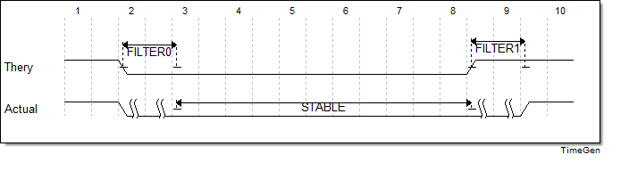
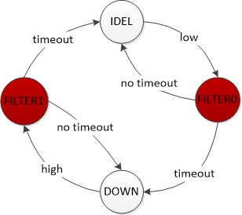
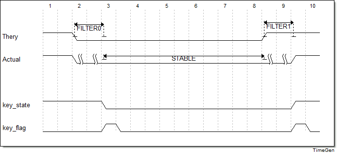
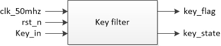
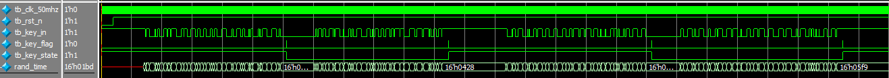
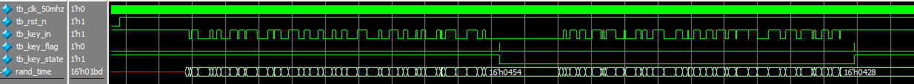
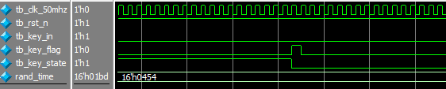
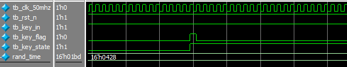

# 按键消抖

[TOC]


## 一：理论

去除按键按下时的抖动状态，获得按键的稳态。理论与实际的按键状态：



在刚按下或者刚释放时候按键存在抖动，如果直接使用按键信号很容易造成问题，所以需要对按键信号进行稳定过滤。按键消抖同样采用状态机设计：



初始状态为IDEL状态（等待低电平）；当检测到低电平时，跳转到FILTER0状态，并开始消抖计时20ms，如果计时完成则表示20ms内无抖动，此时可安全跳转到DOWN稳定状态，否则说明20ms内有高电平抖动，再跳回IDEL初始状态继续等待低电平出现；同样，DOWN状态时（等待高电平），如果出现高电平则跳转到FILTER1状态，并开始消抖计时20ms，如果计时完成则表示20ms内无抖动，此时可安全跳转到IDEL状态，否则再跳回DOWN状态继续等待。

消抖完的时序如图：



key_state表示按键稳定状态；key_flag表示产生状态跳变。故：

- 按键按下：key_flag && !(key_state)
- 按键释放：key_flag && key_state

模块图：



> 计时20ms：
>
> 20ms = 20_000_000ns
>
> 20_000_000ns / 20ns = 1_000_000
>
> 2^19 < 1_000_000 < 2^20


## 二：设计

```verilog
module key_filter(
	input wire clk_50mhz,
	input wire rst_n,
	input wire key_in,
	output reg key_flag,
	output reg key_state
);

parameter IDEL = 4'b0001;
parameter FILTER0 = 4'b0010;
parameter DOWN = 4'b0100;
parameter FILTER1 = 4'b1000;

parameter CNT_20MS = 999_999;

reg [3:0] state;

// 对外部输入的异步信号进行同步处理
reg key_in_a, key_in_b;
always @(posedge clk_50mhz or negedge rst_n)
	if (rst_n == 1'b0) begin
		key_in_a <= 1'b1;
		key_in_b <= 1'b1;
	end
	else begin
		key_in_a <= key_in;
		key_in_b <= key_in_a;
	end

// 上升沿下降沿判断
reg key_last, key_now;
always @(posedge clk_50mhz or negedge rst_n)
	if (rst_n == 1'b0) begin
		key_last <= 1'b1;
		key_now <= 1'b1;
	end
	else begin
		key_now <= key_in_b;
		key_last <= key_now;
	end
wire pedge, nedge;
assign pedge = key_now & (!key_last);
assign nedge = (!key_now) & key_last;

// 计数器(消抖20ms)
reg en_cnt;
reg [19:0] cnt;
always @(posedge clk_50mhz or negedge rst_n)
	if (rst_n == 1'b0)
		cnt <= 20'd0;
	else if (en_cnt) begin
		if (cnt == CNT_20MS)
			cnt <= 20'd0;
		else
			cnt <= cnt + 1'b1;
	end
	else
		cnt <= 20'd0;

reg cnt_full;
always @(posedge clk_50mhz or negedge rst_n)
	if (rst_n == 1'b0)
		cnt_full <= 1'b0;
	else if (cnt == CNT_20MS)
		cnt_full <= 1'b1;
	else
		cnt_full <= 1'b0;

// 状态迁移
always @(posedge clk_50mhz or negedge rst_n)
	if (rst_n == 1'b0) begin
		state <= IDEL;
		en_cnt <= 1'b0;
	end
	else
		case(state)
			IDEL:
				if (nedge) begin
					state <= FILTER0;
					en_cnt <= 1'b1;
				end
			FILTER0:
				if (cnt_full) begin
					state <= DOWN;
					en_cnt <= 1'b0;
				end
				else if (pedge) begin
					state <= IDEL;
					en_cnt <= 1'b0;
				end
			DOWN:
				if (pedge) begin
					state <= FILTER1;
					en_cnt <= 1'b1;
				end
			FILTER1:
				if (cnt_full) begin
					state <= IDEL;
					en_cnt <= 1'b0;
				end
				else if (nedge) begin
					state <= DOWN;
					en_cnt <= 1'b0;
				end
			default:
				begin
					state <= IDEL;
					en_cnt <= 1'b0;
				end
		endcase

// 输出
always @(posedge clk_50mhz or negedge rst_n)
	if (rst_n == 1'b0)
		key_state <= 1'b1;
	else if (state == IDEL)
		key_state <= 1'b1;
	else if (state == FILTER0) begin
		if (cnt_full)
			key_state <= 1'b0;
		else
			key_state <= 1'b1;
	end
	else if (state == DOWN)
		key_state <= 1'b0;
	else if (state == FILTER1) begin
		if (cnt_full)
			key_state <= 1'b1;
		else
			key_state <= 1'b0;
	end

always @(posedge clk_50mhz or negedge rst_n)
	if (rst_n == 1'b0)
		key_flag <= 1'b0;
	else if (state == FILTER0 && cnt_full)
		key_flag <= 1'b1;
	else if (state == FILTER1 && cnt_full)
		key_flag <= 1'b1;
	else
		key_flag <= 1'b0;

endmodule
```

- 由于按键信号并非按照时钟变化，因此需要做同步，消除按键的亚稳态；
- 记录按键信号的上一周期状态，再加上当前状态就可以判定出是上升沿还是下降沿；
- 计时器带有en_cnt使能，在刚跳到FILTER0或者FILTER1时开始计时，计时满ent_full会产生一个时钟周期的高电平；
- key_state和key_flag的跳变并没有delay一个时钟周期，而是与FILTER0或FILTER1状态一同跳变。


## 三：测试

由于20ms的计数在仿真中时间较长，因此使用100替代原来的计数值999_999，即101个时钟周期计数器满。

使用testbench的 `task` 方法模拟按键按下和释放，并分别随机产生50次按键按下抖动和按键释放抖动模拟。

testbench测试：

```verilog
`timescale 1ns/1ns


module tb_key_filter(
);

reg tb_clk_50mhz;
reg tb_rst_n;
reg tb_key_in;
wire tb_key_flag;
wire tb_key_state;

parameter CLK_NS = 20;

// 例化
key_filter #(.CNT_20MS(100)) key_filter_inst0(
	.clk_50mhz(tb_clk_50mhz),
	.rst_n(tb_rst_n),
	.key_in(tb_key_in),
	.key_flag(tb_key_flag),
	.key_state(tb_key_state)
);

// 时钟
always #(CLK_NS / 2) tb_clk_50mhz = ~tb_clk_50mhz;

// 初始化
initial begin
	tb_clk_50mhz = 1'b0;
	tb_rst_n = 1'b0;
	tb_key_in = 1'b1;
	#(CLK_NS * 200);
	
	tb_rst_n = 1'b1;
	#(CLK_NS * 500);
	press_key;
	#(CLK_NS * 500);
	press_key;
	#(CLK_NS * 500);
	press_key;
	#(CLK_NS * 500);
	
	$stop;
end

// 仿真任务(Task)
reg [15:0] rand_time;
task press_key(
);
	begin
		// 50次随机按下抖动(模拟抖动每次小于20ms)
		repeat(50) begin
			rand_time = {$random} % (CLK_NS * 90);
			#rand_time
			tb_key_in = ~tb_key_in;
		end
		
		// DOWN状态
		tb_key_in = 1'b0;
		#(CLK_NS * 500);
		
		// 50次随机释放抖动(模拟抖动每次小于20ms)
		repeat(50) begin
			rand_time = {$random} % (CLK_NS * 90);
			#rand_time
			tb_key_in = ~tb_key_in;
		end
		tb_key_in = 1'b1;
		#(CLK_NS * 500);
	end
endtask

endmodule
```

仿真波形：





按键按下：



按键释放：




## 四：验证

基于AC620平台。

### 4.1 端口

输入(按键)+输出(LED)

```verilog
clk_50mhz	-->	PIN_E1
rst_n		-->	PIN_E16
key_in		-->	key2(PIN_E16)
key_state	--> led0(PIN_A2)

IO Standard: 3.3V-LVTTL
```

### 4.2 结果

运行正确。

