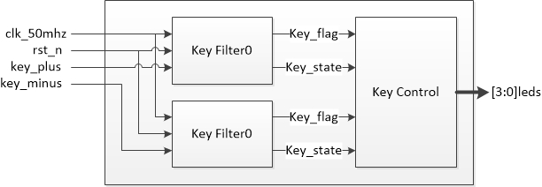
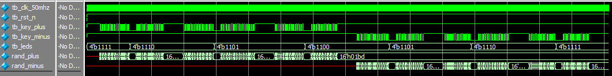

# 按键计数器

[TOC]


## 一：理论

按键计数器。plus和minus按键，按下plus值加一，按下minus值减一；并使用按键消抖模块：




## 二：设计

### 2.1 按键消抖模块设计

详见按键消抖模块。

### 2.2 按键控制模块

按键控制模块根据按键信号控制加减。

```verilog
module key_ctrl(
	input wire clk_50mhz,
	input wire rst_n,
	input wire key_flag0,
	input wire key_state0,
	input wire key_flag1,
	input wire key_state1,
	output wire [3:0] leds
);

reg [3:0] leds_r;

// LEDS输出
// Key0和Key1应该并行判断，但考虑到几乎不同时按这两个按键这里就使用if...else...
always @(posedge clk_50mhz or negedge rst_n)
	if (rst_n == 1'b0)
		leds_r <= 4'b0000;
	else if (key_flag0 && !key_state0)
		leds_r <= leds_r + 1'b1;
	else if (key_flag1 && !key_state1)
		leds_r <= leds_r - 1'b1;

// 根据需要反转
assign leds = ~leds_r;

endmodule
```

### 2.3 顶层模块

```verilog
module key_counter(
	input wire clk_50mhz,
	input wire rst_n,
	input wire key_plus,
	input wire key_minus,
	output wire [3:0] leds
);

// 例化
wire key_flag0, key_state0;
wire key_flag1, key_state1;
key_filter key_filter_inst0(
	.clk_50mhz(clk_50mhz),
	.rst_n(rst_n),
	.key_in(key_plus),
	.key_flag(key_flag0),
	.key_state(key_state0)
);

key_filter key_filter_inst1(
	.clk_50mhz(clk_50mhz),
	.rst_n(rst_n),
	.key_in(key_minus),
	.key_flag(key_flag1),
	.key_state(key_state1)
);

key_ctrl key_ctrl_inst0(
	.clk_50mhz(clk_50mhz),
	.rst_n(rst_n),
	.key_flag0(key_flag0),
	.key_state0(key_state0),
	.key_flag1(key_flag1),
	.key_state1(key_state1),
	.leds(leds)
);

endmodule
```


## 三：测试

同理，由于key_filter延时20ms仿真时间较长，需要改计数999_999为100，即101个时钟周期计数器满。

testbench测试：

```verilog
`timescale 1ns/1ns


module tb_key_counter(
);

reg tb_clk_50mhz;
reg tb_rst_n;
reg tb_key_plus;
reg tb_key_minus;
wire [3:0] tb_leds;

parameter CLK_NS = 20;

// 例化
key_counter key_counter_inst0(
	.clk_50mhz(tb_clk_50mhz),
	.rst_n(tb_rst_n),
	.key_plus(tb_key_plus),
	.key_minus(tb_key_minus),
	.leds(tb_leds)
);

// 时钟
always #(CLK_NS / 2) tb_clk_50mhz = ~tb_clk_50mhz;

// 初始化
initial begin
	tb_clk_50mhz = 1'b0;
	tb_rst_n = 1'b0;
	tb_key_plus = 1'b1;
	tb_key_minus = 1'b1;
	#(CLK_NS * 10)
	
	tb_rst_n = 1'b1;
	#(CLK_NS * 1000)
	
	press_plus;
	#(CLK_NS * 1000);
	press_plus;
	#(CLK_NS * 1000);
	press_plus;
	#(CLK_NS * 1000);
	press_minus;
	#(CLK_NS * 1000);
	press_minus;
	#(CLK_NS * 1000);
	press_minus;
	#(CLK_NS * 1000);
	
	$stop;
end

// 模拟按键plus(Task)
reg [15:0] rand_plus;
task press_plus;
	begin
		// 50次随机按下抖动(每次不大于20ms)
		repeat(50) begin
			rand_plus = {$random} % (CLK_NS * 90);
			#rand_plus
			tb_key_plus = ~tb_key_plus;
		end
		
		// DOWN状态
		tb_key_plus = 1'b0;
		#(CLK_NS * 500);
		
		// 50次随机释放抖动(每次不大于20ms)
		repeat(50) begin
			rand_plus = {$random} % (CLK_NS * 90);
			#rand_plus
			tb_key_plus = ~tb_key_plus;
		end
		tb_key_plus = 1'b1;
		#(CLK_NS * 500);
	end
endtask

// 模拟按键minus(Task)
reg [15:0] rand_minus;
task press_minus;
	begin
		// 50次随机按下抖动(每次不大于20ms)
		repeat(50) begin
			rand_minus = {$random} % (CLK_NS * 90);
			#rand_minus
			tb_key_minus = ~tb_key_minus;
		end
		
		// DOWN状态
		tb_key_minus = 1'b0;
		#(CLK_NS * 500);
		
		// 50次随机释放抖动(每次不大于20ms)
		repeat(50) begin
			rand_minus = {$random} % (CLK_NS * 90);
			#rand_minus
			tb_key_minus = ~tb_key_minus;
		end
		tb_key_minus = 1'b1;
		#(CLK_NS * 500);
	end
endtask

endmodule
```

仿真波形：



可见按键加和按键减均达到理想作用，符合预期。


## 四：验证

基于AC620平台。

### 4.1 端口

输入(按键)+输出(LED)。LED按照十六进制形式显示当前数字。

```verilog
clk_50mhz	-->	PIN_E1
rst_n		-->	PIN_E16
key_plus	-->	PIN_M16
key_minus	-->	PIN_E15
leds		-->	PIN_A2,PIN_B3,PIN_A4,PIN_A3

IO Standard: 3.3V-LVTTL
```

### 4.2 结果

运行正确。

