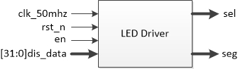
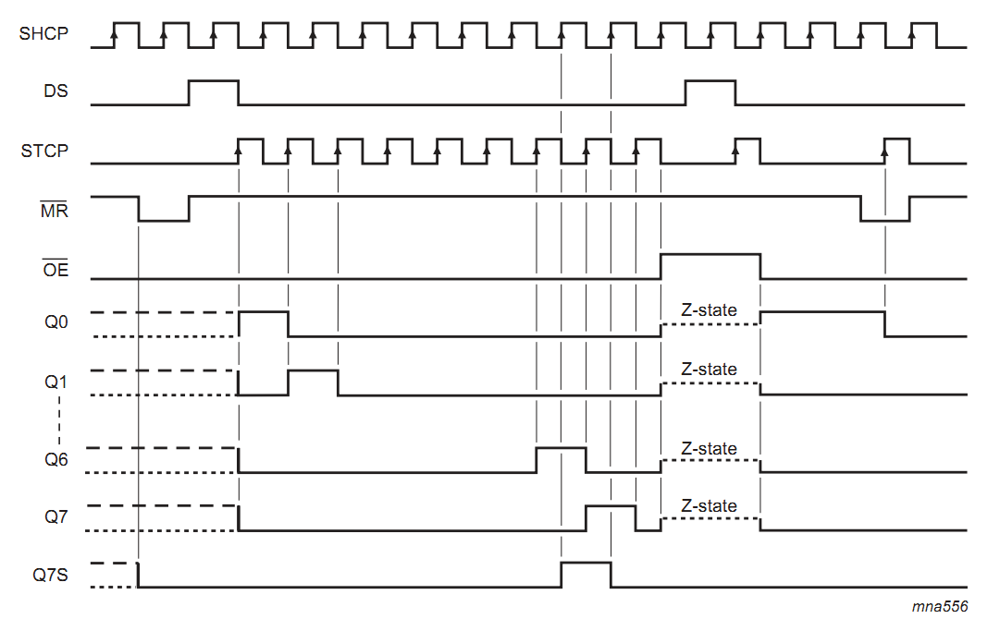
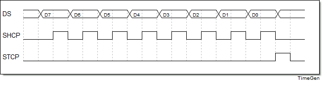
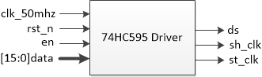
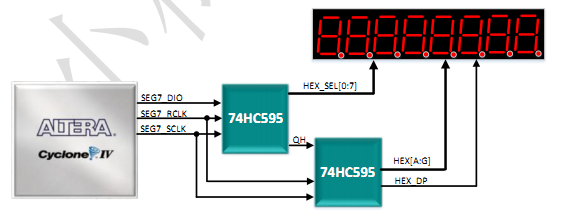

# 8位7段数码管驱动

[TOC]


## 一：理论

### 1.1 动态扫描数码管

共阳数码管，码值：

| 显示   | a    | b    | c    | d    | e    | f    | g    | h    | 段码    |
| ---- | ---- | ---- | ---- | ---- | ---- | :--- | ---- | ---- | ----- |
| 0    | 0    | 0    | 0    | 0    | 0    | 0    | 1    | 1    | 8'hc0 |
| 1    | 1    | 0    | 0    | 1    | 1    | 1    | 1    | 1    | 8'hf9 |
| 2    | 0    | 0    | 1    | 0    | 0    | 1    | 0    | 1    | 8'ha4 |
| 3    | 0    | 0    | 0    | 0    | 1    | 1    | 0    | 1    | 8'hb0 |
| 4    | 1    | 0    | 0    | 1    | 1    | 0    | 0    | 1    | 8'h99 |
| 5    | 0    | 1    | 0    | 0    | 1    | 0    | 0    | 1    | 8'h92 |
| 6    | 0    | 1    | 0    | 0    | 0    | 0    | 0    | 1    | 8'h82 |
| 7    | 0    | 0    | 0    | 1    | 1    | 1    | 1    | 1    | 8'hf8 |
| 8    | 0    | 0    | 0    | 0    | 0    | 0    | 0    | 1    | 8'h80 |
| 9    | 0    | 0    | 0    | 0    | 1    | 0    | 0    | 1    | 8'h90 |
| a    | 0    | 0    | 0    | 1    | 0    | 0    | 0    | 1    | 8'h88 |
| b    | 1    | 1    | 0    | 0    | 0    | 0    | 0    | 1    | 8'h83 |
| c    | 0    | 1    | 1    | 0    | 0    | 0    | 1    | 1    | 8'hc6 |
| d    | 1    | 0    | 0    | 0    | 0    | 1    | 0    | 1    | 8'ha1 |
| e    | 0    | 1    | 1    | 0    | 0    | 0    | 0    | 1    | 8'h86 |
| f    | 0    | 1    | 1    | 1    | 0    | 0    | 0    | 1    | 8'h8c |

数码管使用动态扫描显示，扫描频率1KHz，即每1ms切换到下一个数码管。数码管由：**位选sel+段选seg** 控制，位选选择当前显示的数码管，段选为要显示内容的码值。

```verilog
1ms = 1_000_000ns
1_000_000ns / 20ns = 50_000
2^15 < 50_000 < 2^16
```

模块：



### 1.2 74HC595串转并

由于直接驱动数码管IO占用较多，故采用串转并模块间接驱动。采用的模块为74HC595。工作时序：



SHCP上升沿时数据进入移位寄存器；STCP上升沿时数据从移位寄存器进入数据存储寄存器。实际使用时，STCP通常置低，SHCP上升沿时依次更新数据，数据更新完毕后STCP置高，在STCP的上升沿更新74hc595数据寄存器的数据：





采用两个74HC595级联方式驱动8位7段数码管，低位输出位选sel，高位输出段选seg：




## 二：设计

`assign` 语句的使用。`assign`语句及时生效，物理特性表征的是一条连接导线。

```verilog
module mux2(
	input wire a,
	input wire b,
	input wire sel,
	output wire out
);

assign out = (sel ? a : b);

endmodule
```


## 三：测试

### 3.1 TestBench

测试需遍历所有可能情况：

| sel  | a    | b    | out期望输出 |
| ---- | ---- | ---- | ------- |
| 0    | 0    | 0    | 0       |
| 0    | 0    | 1    | 0       |
| 0    | 1    | 0    | 1       |
| 0    | 1    | 1    | 1       |
| 1    | 0    | 0    | 0       |
| 1    | 0    | 1    | 1       |
| 1    | 1    | 0    | 0       |
| 1    | 1    | 1    | 1       |

testbench测试：

```verilog
`timescale 1ns/1ns
 

module tb_mux2(
);

reg tb_a;
reg tb_b;
reg tb_sel;
wire tb_out;

// mux2例化
mux2 mux2_inst0(
	.a(tb_a),
	.b(tb_b),
	.sel(tb_sel),
	.out(tb_out)
);

// 初始化
initial begin
	tb_sel = 0;tb_a = 0;tb_b = 0;
	#100
	tb_sel = 0;tb_a = 0;tb_b = 1;
	#100
	tb_sel = 0;tb_a = 1;tb_b = 0;
	#100
	tb_sel = 0;tb_a = 1;tb_b = 1;
	#100
	tb_sel = 1;tb_a = 0;tb_b = 0;
	#100
	tb_sel = 1;tb_a = 0;tb_b = 1;
	#100
	tb_sel = 1;tb_a = 1;tb_b = 0;
	#100
	tb_sel = 1;tb_a = 1;tb_b = 1;
	#100

	$stop;
end

endmodule
```

### 3.2 波形


## 四：验证

基于AC620平台。

### 4.1 端口

输入(按键)+输出(LED)

```verilog
a	-->	key0(PIN_M16)
b	-->	key1(PIN_E15)
sel	-->	key2(PIN_E16)
out	-->	led0(PIN_A2)

IO Standard: 3.3V-LVTTL
```

### 4.2 结果

运行正确。

