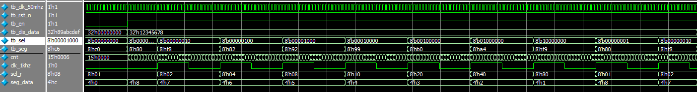
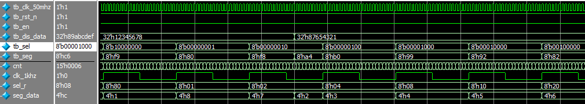
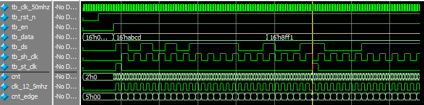
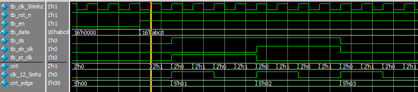

# 8位7段数码管驱动

[TOC]


## 一：理论

### 1.1 动态扫描数码管

共阳数码管，码值：

| 显示   | a    | b    | c    | d    | e    | f    | g    | h    | 段码    |
| ---- | ---- | ---- | ---- | ---- | ---- | :--- | ---- | ---- | ----- |
| 0    | 0    | 0    | 0    | 0    | 0    | 0    | 1    | 1    | 8'hc0 |
| 1    | 1    | 0    | 0    | 1    | 1    | 1    | 1    | 1    | 8'hf9 |
| 2    | 0    | 0    | 1    | 0    | 0    | 1    | 0    | 1    | 8'ha4 |
| 3    | 0    | 0    | 0    | 0    | 1    | 1    | 0    | 1    | 8'hb0 |
| 4    | 1    | 0    | 0    | 1    | 1    | 0    | 0    | 1    | 8'h99 |
| 5    | 0    | 1    | 0    | 0    | 1    | 0    | 0    | 1    | 8'h92 |
| 6    | 0    | 1    | 0    | 0    | 0    | 0    | 0    | 1    | 8'h82 |
| 7    | 0    | 0    | 0    | 1    | 1    | 1    | 1    | 1    | 8'hf8 |
| 8    | 0    | 0    | 0    | 0    | 0    | 0    | 0    | 1    | 8'h80 |
| 9    | 0    | 0    | 0    | 0    | 1    | 0    | 0    | 1    | 8'h90 |
| a    | 0    | 0    | 0    | 1    | 0    | 0    | 0    | 1    | 8'h88 |
| b    | 1    | 1    | 0    | 0    | 0    | 0    | 0    | 1    | 8'h83 |
| c    | 0    | 1    | 1    | 0    | 0    | 0    | 1    | 1    | 8'hc6 |
| d    | 1    | 0    | 0    | 0    | 0    | 1    | 0    | 1    | 8'ha1 |
| e    | 0    | 1    | 1    | 0    | 0    | 0    | 0    | 1    | 8'h86 |
| f    | 0    | 1    | 1    | 1    | 0    | 0    | 0    | 1    | 8'h8c |

数码管使用动态扫描显示，扫描频率1KHz，即每1ms切换到下一个数码管。数码管由：**位选sel+段选seg** 控制，位选选择当前显示的数码管，段选为要显示内容的码值。

```verilog
1ms = 1_000_000ns
1_000_000ns / 20ns = 50_000
2^15 < 50_000 < 2^16
```

模块：


### 1.2 74HC595串转并

由于直接驱动数码管IO占用较多，故采用串转并模块间接驱动。采用的模块为74HC595。工作时序：


SHCP上升沿时数据进入移位寄存器；STCP上升沿时数据从移位寄存器进入数据存储寄存器。实际使用时，STCP通常置低，SHCP上升沿时依次更新数据，数据更新完毕后STCP置高，在STCP的上升沿更新74hc595数据寄存器的数据：


工作频率选择 **12.5MHz** ：

```verilog
12.5MHz --> 80ns
80ns / 20ns = 4
2^2 <= 4 < 2^3
```

模块：


采用两个74HC595级联方式驱动8位7段数码管，低位输出位选sel，高位输出段选seg；级联时候DS为16位数据输入，高8位自动移入第二个74HC595：


## 二：设计

### 2.1 数码管驱动

数码管动态扫描频率1KHz，计数值为50_000；故生成扫描时钟的反转周期为1/2计数值，即25_000。

```verilog
module led_driver(
	input wire clk_50mhz,
	input wire rst_n,
	input wire en,
	input wire [31:0] dis_data,
	output wire [7:0] sel,
	output reg [7:0] seg
);

parameter CNT_1KHZ = 24_999;

// 时钟模块：50Mhz -> 1KHz
reg [14:0] cnt;
always @(posedge clk_50mhz or negedge rst_n)
	if (rst_n == 1'b0)
		cnt <= 15'd0;
	else if (en) begin
		if (cnt == CNT_1KHZ)
			cnt <= 15'd0;
		else
			cnt <= cnt + 1'b1;
	end
	else
		cnt <= 15'd0;

reg clk_1khz;
always @(posedge clk_50mhz or negedge rst_n)
	if (rst_n == 1'b0)
		clk_1khz <= 1'b0;
	else if (en) begin
		if (cnt == CNT_1KHZ)
			clk_1khz <= ~clk_1khz;
	end
	else
		clk_1khz <= 1'b0;


// 移位寄存器模块
// 根据1KHz时钟移位循环选择数码管，这是动态显示的激励源
reg [7:0] sel_r;
always @(posedge clk_1khz or negedge rst_n)
	if (rst_n == 1'b0)
		sel_r <= 8'b0000_0001;
	else if (sel_r == 8'b1000_0000)
		sel_r <= 8'b0000_0001;
	else
		sel_r <= sel_r << 1;
		
assign sel = en ? sel_r : 8'b0000_0000;


// 数码管显示字符选择(seg_data)
// 从[31:0]的dis_data中选择当前sel对应的字符
// seg在sel改变时立即改变，最好是assign方式，这里使用always方式达到相同效果。
reg [3:0] seg_data;
always @(*)
	case(sel_r)
		8'b0000_0001:seg_data = dis_data[3:0];
		8'b0000_0010:seg_data = dis_data[7:4];
		8'b0000_0100:seg_data = dis_data[11:8];
		8'b0000_1000:seg_data = dis_data[15:12];
		8'b0001_0000:seg_data = dis_data[19:16];
		8'b0010_0000:seg_data = dis_data[23:20];
		8'b0100_0000:seg_data = dis_data[27:24];
		8'b1000_0000:seg_data = dis_data[31:28];
		default:;
	endcase

// BCD码到数码管显示码译码
// 同样，译码希望是及时的，最好使用assign，这里使用always达到相同效果。
// 第一位是小数点，保留(1)。
always @(*)
	case(seg_data)
		4'b0000:seg = 8'b11000_000; // 0
		4'b0001:seg = 8'b11111_001; // 1
		4'b0010:seg = 8'b10100_100; // 2
		4'b0011:seg = 8'b10110_000; // 3
		4'b0100:seg = 8'b10011_001; // 4
		4'b0101:seg = 8'b10010_010; // 5
		4'b0110:seg = 8'b10000_010; // 6
		4'b0111:seg = 8'b11111_000; // 7
		4'b1000:seg = 8'b10000_000; // 8
		4'b1001:seg = 8'b10010_000; // 9
		4'b1010:seg = 8'b10001_000; // A
		4'b1011:seg = 8'b10000_011; // B
		4'b1100:seg = 8'b11000_110; // C
		4'b1101:seg = 8'b10100_001; // D
		4'b1110:seg = 8'b10000_110; // E
		4'b1111:seg = 8'b10001_110; // F
		default:;
	endcase
	
endmodule
```

- 首先生成数码管工作时钟clk_1khz，然后根据工作时钟操作；
- sel变化的同时seg产生变化；如果seg的语句块敏感列表写的是clk_1khz，则seg变化会滞后一个时钟周期。

### 2.2 74HC595驱动

74HC595工作频率为12.5MHz，计数值4；故生成74HC595工作时钟反转周期为1/2计数值，即2。

```verilog
module hc595_driver(
	input wire clk_50mhz,
	input wire rst_n,
	input wire en,
	input wire [15:0] data,
	output reg ds,
	output reg sh_clk,
	output reg st_clk
);

parameter CNT_12_5MHZ = 1;

// 工作时钟：50MHz -> 12.5 MHz
reg [1:0] cnt;
always @(posedge clk_50mhz or negedge rst_n)
	if (rst_n == 1'b0)
		cnt <= 2'd0;
	else if (en) begin
		if (cnt == CNT_12_5MHZ)
			cnt <= 2'd0;
		else
			cnt <= cnt + 1'b1;
	end
	else
		cnt <= 2'd0;

reg clk_12_5mhz;
always @(posedge clk_50mhz or negedge rst_n)
	if (rst_n == 1'b0)
		clk_12_5mhz <= 1'b0;
	else if (cnt == CNT_12_5MHZ)
		clk_12_5mhz <= ~clk_12_5mhz;
	else
		clk_12_5mhz <= clk_12_5mhz;


// 利用12.5Mhz进行计数，计数产生sh_clk和st_clk，并控制数据赋值
reg [4:0] cnt_edge;
always @(posedge clk_12_5mhz or negedge rst_n)
	if (rst_n == 1'b0)
		cnt_edge <= 5'd0;
	else if (cnt_edge == 5'd31)
		cnt_edge <= 5'd0;
	else
		cnt_edge <= cnt_edge + 1'b1;

always @(posedge clk_12_5mhz or negedge rst_n)
	if (rst_n == 1'b0) begin
		sh_clk <= 1'b0;
		st_clk <= 1'b0;
		ds <= 1'b0;
	end
	else
		case(cnt_edge)
			5'd0:begin sh_clk<=1'b0;st_clk<=1'b1;ds<=data[15];end
			5'd1:begin sh_clk<=1'b1;st_clk<=1'b0;end
			5'd2:begin sh_clk<=1'b0;ds<=data[14];end
			5'd3:begin sh_clk<=1'b1;end
			5'd4:begin sh_clk<=1'b0;ds<=data[13];end
			5'd5:begin sh_clk<=1'b1;end
			5'd6:begin sh_clk<=1'b0;ds<=data[12];end
			5'd7:begin sh_clk<=1'b1;end
			5'd8:begin sh_clk<=1'b0;ds<=data[11];end
			5'd9:begin sh_clk<=1'b1;end
			5'd10:begin sh_clk<=1'b0;ds<=data[10];end
			5'd11:begin sh_clk<=1'b1;end
			5'd12:begin sh_clk<=1'b0;ds<=data[9];end
			5'd13:begin sh_clk<=1'b1;end
			5'd14:begin sh_clk<=1'b0;ds<=data[8];end
			5'd15:begin sh_clk<=1'b1;end
			5'd16:begin sh_clk<=1'b0;ds<=data[7];end
			5'd17:begin sh_clk<=1'b1;end
			5'd18:begin sh_clk<=1'b0;ds<=data[6];end
			5'd19:begin sh_clk<=1'b1;end
			5'd20:begin sh_clk<=1'b0;ds<=data[5];end
			5'd21:begin sh_clk<=1'b1;end
			5'd22:begin sh_clk<=1'b0;ds<=data[4];end
			5'd23:begin sh_clk<=1'b1;end
			5'd24:begin sh_clk<=1'b0;ds<=data[3];end
			5'd25:begin sh_clk<=1'b1;end
			5'd26:begin sh_clk<=1'b0;ds<=data[2];end
			5'd27:begin sh_clk<=1'b1;end
			5'd28:begin sh_clk<=1'b0;ds<=data[1];end
			5'd29:begin sh_clk<=1'b1;end
			5'd30:begin sh_clk<=1'b0;ds<=data[0];end
			5'd31:begin sh_clk<=1'b1;end
			default:;
		endcase
		
endmodule
```

- 首先生成74HC595工作时钟clk_12_5mhz，然后根据时钟工作；
- 状态迁移的敏感列表为clk_12_5mhz，因此会较cnt_edge的变化滞后一个时钟周期；但由于数据一直连续传输，因此并无太大影响；
- st_clk应该在传输完成时置高，程序中将置高提到传输刚开始时，同步的其实是上一次的数据传输；由于数据一直连续传输，因此并无影响。

### 2.3 顶层模块

顶层模块结合数码管驱动和74HC595驱动，组合成完整的8位7段数码管驱动设计。其主要工作是实例化，为了可以动态改变数码管显示的数值，加入 **ISSP** 模块功能，ISSP会产生要显示的字符且支持界面操作：

```verilog
module led_display(
	input wire clk_50mhz,
	input wire rst_n,
	output wire ds,
	output wire sh_clk,
	output wire st_clk
);

wire [31:0] dis_data;
wire [7:0] sel;
wire [7:0] seg;


// ISSP例化
hex_data hex_data_inst0(
	.probe(),
	.source(dis_data)
);


// LED驱动例化
led_driver led_driver_inst0(
	.clk_50mhz(clk_50mhz),
	.rst_n(rst_n),
	.en(1'b1),
	.dis_data(dis_data),
	.sel(sel),
	.seg(seg)
);


// HC959例化
hc595_driver hc595_driver_inst0(
	.clk_50mhz(clk_50mhz),
	.rst_n(rst_n),
	.en(1'b1),
	.data({seg, sel}),
	.ds(ds),
	.sh_clk(sh_clk),
	.st_clk(st_clk)
);

endmodule
```


## 三：测试

### 3.1 数码管驱动测试

数码管内部生成1KHz时钟自动扫描，故只需给出相应信号且执行一段时间即可。由于1KHz计数值较大，仿真时间较长，故仿真时将CNT_1KHZ改为10缩小仿真时间：

```verilog
`timescale 1ns/1ns


module tb_led_driver(
);

reg tb_clk_50mhz;
reg tb_rst_n;
reg tb_en;
reg [31:0] tb_dis_data;
wire [7:0] tb_sel;
wire [7:0] tb_seg;

parameter CLK_NS = 20;

// 例化
led_driver #(.CNT_1KHZ(10)) led_driver_inst0(
	.clk_50mhz(tb_clk_50mhz),
	.rst_n(tb_rst_n),
	.en(tb_en),
	.dis_data(tb_dis_data),
	.sel(tb_sel),
	.seg(tb_seg)
);

// 时钟
always #(CLK_NS / 2) tb_clk_50mhz = ~tb_clk_50mhz;

// 初始化
initial begin
	tb_clk_50mhz = 1'b0;
	tb_rst_n = 1'b0;
	tb_en = 1'b0;
	tb_dis_data = 32'd0;
	#(CLK_NS * 100)
	
	tb_rst_n = 1'b1;
	#(CLK_NS * 100)
	
	tb_en = 1'b1;
	tb_dis_data = 32'h12345678;
	#(CLK_NS * 200)
	tb_dis_data = 32'h87654321;
	#(CLK_NS * 200);
	tb_dis_data = 32'h89abcdef;
	#(CLK_NS * 200);
	
	$stop;
end

endmodule
```

仿真波形：





- 刚开始时第一个tb_sel周期较短，因为clk_1khz的第一个上升沿早到半个周期，后续时序正常，这并不影响整体功能；
- 当显示数据切换时seg能够立马更新数据。

由仿真可知设计符合预期。

### 3.2 74HC595驱动测试

74HC595与数码管类似，内部也有工作时钟12.5MHz，且内部自动连续转换，由于CNT_12_5MHZ计数值不大，因此仿真时无需改动：

```verilog
`timescale 1ns/1ns


module tb_hc595_driver(
);

reg tb_clk_50mhz;
reg tb_rst_n;
reg tb_en;
reg [15:0] tb_data;
wire tb_ds;
wire tb_sh_clk;
wire tb_st_clk;

parameter CLK_NS = 20;

// 例化
hc595_driver hc595_driver_inst0(
	.clk_50mhz(tb_clk_50mhz),
	.rst_n(tb_rst_n),
	.en(tb_en),
	.data(tb_data),
	.ds(tb_ds),
	.sh_clk(tb_sh_clk),
	.st_clk(tb_st_clk)
);

// 时钟
always #(CLK_NS / 2) tb_clk_50mhz = ~tb_clk_50mhz;

// 初始化
initial begin
	tb_clk_50mhz = 1'b0;
	tb_rst_n = 1'b0;
	tb_en = 1'b0;
	tb_data = 16'h0000;
	#(CLK_NS * 10)
	
	tb_rst_n = 1'b1;
	#(CLK_NS * 10)
	
	tb_en = 1'b1;
	tb_data = 16'habcd;
	#(CLK_NS * 100)
	tb_data = 16'h8ff1;
	#(CLK_NS * 100)
	
	$stop;
end

endmodule
```





同样，clk_12_5mhz的第一个上升沿提前半个周期，但并不影响后续时序。可见设计满足预期。

### 3.3 顶层模块测试

顶层模块使用ISSP，因此可下载到开发板测试，详见验证阶段。


## 四：验证

基于AC620平台。

### 4.1 端口

ISSP(界面)

```verilog
clk_50mhz	-->	PIN_E1
rst_n		-->	PIN_E16
ds			-->	PIN_E6
sh_clk		-->	PIN_F6
st_clk		-->	PIN_B4

IO Standard: 3.3V-LVTTL
```

### 4.2 结果

运行正确。

